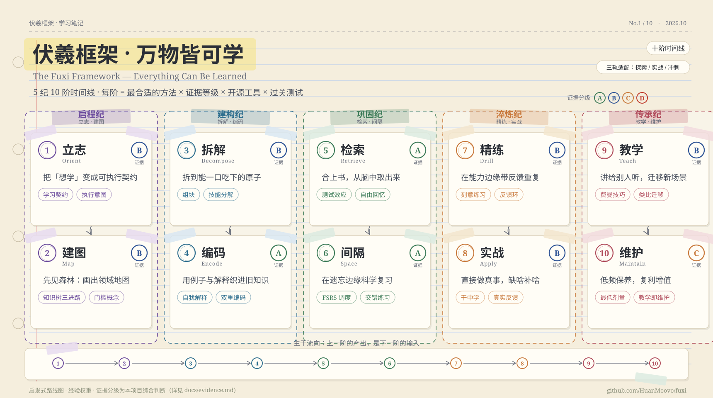

[简体中文](./README.md) ｜ **English** ｜ [日本語](./README.ja.md)

# Fuxi Framework — Everything Can Be Learned

> **The Fuxi Framework** (伏羲框架 · 万物皆可学) organizes "learning anything" into a **10-stage timeline**. Every stage ships with the most suitable methods, an evidence grade (A/B/C/D), open-source tools, and a self-test.
> 中文主文档：[README.md](./README.md) ｜ 在线主页：[HuanMoovo.github.io/fuxi](https://HuanMoovo.github.io/fuxi/)

> Tip: click any image to enlarge it (opens the original).

## The 10-Stage Timeline

| # | Stage | Output | Core methods | Evidence |
|---|-------|--------|--------------|----------|
| 1 | Orient | A one-page learning contract | goal hierarchy · if-then plans · WOOP | B |
| 2 | Map | A one-page domain map | knowledge tree (history / comparison / top-down) · concept maps · threshold concepts | B |
| 3 | Decompose | Atom list + practice actions | chunking · skill decomposition · whole-task design | B |
| 4 | Encode | "Simplest explanation" + first cards | self-explanation · elaborative interrogation · dual coding · worked examples | A/B |
| 5 | Retrieve | Free-recall practice + calibration data | testing effect · free recall · self-made cards | **A** |
| 6 | Space | FSRS scheduling + interleaved sets | spaced repetition · FSRS · interleaving · varied practice | **A** |
| 7 | Drill | An error-log feedback loop | deliberate practice · feedback design · cognitive apprenticeship | B |
| 8 | Apply | Real deliverables others can check | learning-by-doing loop · directness · projects · real feedback | B |
| 9 | Teach | Public output + transfer tests | Feynman technique · teaching effect · analogical transfer | B |
| 10 | Maintain | Low-dose, compounding system | minimal maintenance dose · teach-to-maintain · spiraling up | C |

**The output of one stages is the input of the next.** Three tracks (Explore / Build / Exam-sprint) adapt stage weights to your goal — see [docs/paths.md](./docs/paths.md).

## Evidence Base — highlights

- Retrieval practice: ~80% vs ~35% recall after one week (retrieval vs restudy). [Karpicke & Roediger 2008](https://doi.org/10.1126/science.1152408)
- Spaced practice beats massed practice; optimal gap ≈ 10–20% of the target retention interval. [Cepeda et al. 2006](https://pubmed.ncbi.nlm.nih.gov/16719566/) · [2008](https://doi.org/10.1111/j.1467-9280.2008.02209.x)
- Interleaved math practice: 61% vs 38% on delayed tests (d=0.83). [Rohrer et al. 2020](https://gwern.net/doc/psychology/spaced-repetition/2019-rohrer.pdf)
- FSRS scheduler: built on 220M review logs, +12.6% over previous SOTA, shipped in Anki. [Ye et al. 2022](https://dl.acm.org/doi/10.1145/3534678.3539081)
- Unguarded AI assistants: +48% during practice, −17% on exams after removal. [Bastani et al. 2025](https://www.pnas.org/doi/10.1073/pnas.2422633122)

Full table (30 findings, 70+ references, A–D grades): [docs/evidence.md](./docs/evidence.md).

## Toolchain (open source first)

Anki + [FSRS](https://github.com/open-spaced-repetition/fsrs4anki) · [Obsidian](https://github.com/obsidianmd/obsidian-releases) / [Logseq](https://github.com/logseq/logseq) · [markmap](https://github.com/markmap/markmap) / [Excalidraw](https://github.com/excalidraw/excalidraw) · [Exercism](https://github.com/exercism/exercism) / [freeCodeCamp](https://github.com/freeCodeCamp/freeCodeCamp) / [The Odin Project](https://github.com/TheOdinProject/theodinproject) · [Lean 4](https://github.com/leanprover/lean4) · [Yomitan](https://github.com/yomidevs/yomitan) / [asbplayer](https://github.com/killergerbah/asbplayer) · [Quartz](https://github.com/jackyzha0/quartz) · [Ollama](https://github.com/ollama/ollama).
Full list (50+ tools, link-checked): [docs/tools.md](./docs/tools.md).

## AI Co-pilot Protocol (7 rules)

1. Produce first, let AI critique second — never the reverse.
2. During retrieval: AI asks questions; you never ask for answers.
3. Roles: sparring partner / examiner / devil's advocate — not ghostwriter.
4. Verify every number and citation AI gives you against the source.
5. Run periodic "no-AI delayed tests" — if the crutch is gone, can you still walk?
6. Audit what the AI took off your plate — that's exactly what you must practice.
7. Prefer local/open-source models ([Ollama](https://github.com/ollama/ollama)) for control.

Positive proof it *can* work: a well-designed AI tutor produced 0.73–1.3 SD gains in less time ([Kestin et al. 2025](https://doi.org/10.1038/s41598-025-97652-6)) — design matters, not the mere presence of AI.

## Get Started in 30 Minutes

1. Pick a track (Explore / Build / Exam-sprint).
2. Fill a [learning contract](./templates/learning-contract.md) — three verifiable outcomes only.
3. Sketch your [domain map](./docs/stages/02-map.md) — structure over beauty.
4. Make [3 flashcards](./templates/card-rules.md) and install [Anki + FSRS](https://github.com/open-spaced-repetition/fsrs4anki).
5. Tomorrow: start a 25-min/day rhythm; in a week, run your first blank-page recall test.

## Repo Map

`docs/stages/` (10 stage guides) · `docs/evidence.md` (evidence base) · `docs/tools.md` (toolchain) · `docs/paths.md` (tracks & domains) · `docs/myths.md` (15 myths debunked) · `docs/faq.md` · `templates/` (contracts & logs) · `generator/` (reproducible SVG charts) · `docs/index.html` (site).

## Contributing & License

Add a **reference**, a **tool**, or a **correction** via [issue templates](https://github.com/HuanMoovo/fuxi/issues/new/choose) — see [CONTRIBUTING.md](./CONTRIBUTING.md). Code: MIT; docs & diagrams: CC BY 4.0.

Verified 2026-10-03 · Evidence grades are this project's synthesis, not journal ratings.
