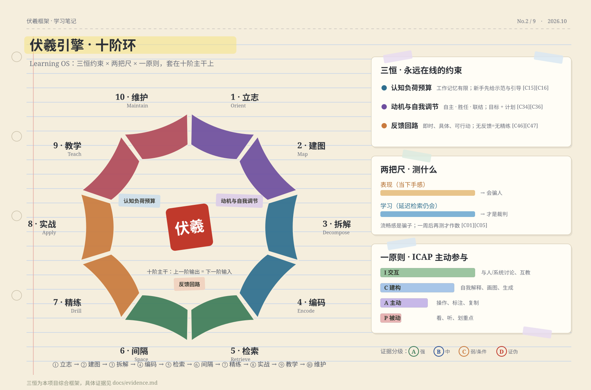
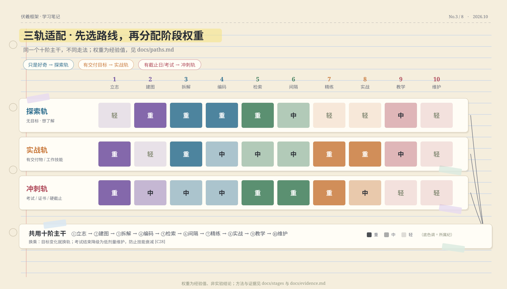

# 伏羲框架 · 万物皆可学

> **The Fuxi Framework — Everything Can Be Learned**
> 把「学会一样东西」拆成一条 **5 纪 10 阶** 的时间线：每阶告诉你 **最合适的方法 × 证据等级 × 开源工具 × 过关测试**。

[](./LICENSE)
[](./docs/evidence.md)
[](./docs/paths.md)
[](https://github.com/HuanMoovo/fuxi/actions/workflows/links.yml)


**一句话**：学习不是玄学也不是苦役，而是一套可以工程化的流程 —— 先建图、再填肉；先检索、再重复；先做真事、再谈精通。

<div align="center">

[十阶详解](#十阶时间线) · [证据库](./docs/evidence.md) · [开源工具链](./docs/tools.md) · [三大路线](./docs/paths.md) · [误区辟谣](./docs/myths.md) · [学习模板](./templates/) · [在线主页](https://HuanMoovo.github.io/fuxi/)

</div>

---

## 目录

- [为什么需要这个框架](#为什么需要这个框架)
- [十阶时间线](#十阶时间线)
- [引擎：三恒 · 两尺 · 一原则](#引擎三恒--两尺--一原则)
- [证据底座](#证据底座)
- [开源工具链](#开源工具链)
- [三大路线：先选走法](#三大路线先选走法)
- [立即开始（30 分钟行动版）](#立即开始30-分钟行动版)
- [AI 副驾协议](#ai-副驾协议)
- [常见误区](#常见误区)
- [仓库导航](#仓库导航)
- [迭代与贡献](#迭代与贡献)
- [引用本框架](#引用本框架)
- [English Summary](#english-summary)
- [许可](#许可)

---

## 为什么需要这个框架

1. **方法碎片化**：费曼技巧、番茄钟、卡片盒、刻意练习……全是散装零件，没人告诉你**什么时候该用哪个**。
2. **伪科学横行**：学习金字塔、学习风格匹配、速读神话被反复传播，而真正高证据强度的方法（检索练习、间隔重复、交错练习）反而没人用（[Dunlosky et al., 2013](<https://pubmed.ncbi.nlm.nih.gov/26173288/)>）。
3. **爽感陷阱**：重读、划线、看视频都让人「感觉在学」，但延迟测验一做就露馅 —— 流畅感是骗子（[Karpicke & Roediger, 2008](<https://doi.org/10.1126/science.1152408)>）。
4. **AI 时代的新风险**：无护栏的生成式 AI 会让人练习期更顺、撤掉后更差（[Bastani et al., 2025, PNAS](<https://www.pnas.org/doi/10.1073/pnas.2422633122)>）—— 本框架把「安全使用 AI」写进了每一阶。

> 本框架的**双路径思想**（搭框架 / 干中学）受 B 站方法论视频 [BV1SUdBUBE18](https://www.bilibili.com/video/BV1SUdBUBE18/) 启发，在此基础上扩展为完整的十阶时间线，并为每个方法补充证据分级与开源工具链。

---

## 十阶时间线

> 每个阶段都有独立详解文档：目标 → 认知机制 → 方法卡（含证据等级）→ 工具 → 过关自测 → 误区 → AI 用法。

| # | 阶段 | 产出物 | 核心方法 | 关键工具 | 证据 |
|---|------|--------|----------|----------|------|
| ① | [立志](./docs/stages/01-orient.md) | 一页学习契约 | 目标层级 · 执行意图(if-then) · WOOP · 时间预算 | Super Productivity · Loop · ActivityWatch | B |
| ② | [建图](./docs/stages/02-map.md) | 一页领域地图 | 知识树三进路（发展史/对比/顶点倒推）· 概念图 · 门槛概念 | markmap · Excalidraw · roadmap.sh | B |
| ③ | [拆解](./docs/stages/03-decompose.md) | 原子清单 + 练习动作 | 组块化 · 技能分解 · 全任务设计 · 依赖排序 | Obsidian · Logseq · markmap | B |
| ④ | [编码](./docs/stages/04-encode.md) | 最简解释 + 第一批卡 | 自我解释 · 精细提问 · 生成效应 · 双重编码 · 示范题淡出 | Obsidian · Zettlr · Zotero · Excalidraw | A/B |
| ⑤ | [检索](./docs/stages/05-retrieve.md) | 空白纸回忆 + 校准数据 | 测试效应 · 自由回忆 · 自建卡片 · 预测试 · 反馈修正 | Anki · Logseq · genanki | **A** |
| ⑥ | [间隔](./docs/stages/06-space.md) | FSRS 调度 + 交错题单 | 间隔重复 · FSRS 算法 · 交错练习 · 变式练习 | Anki + FSRS4Anki · FSRS Helper | **A** |
| ⑦ | [精练](./docs/stages/07-drill.md) | 错误日志闭环 | 刻意练习四要素 · 反馈设计 · 认知学徒制 · 先失败后教学 | Exercism · KaTrain · Audacity · LanguageTool | B |
| ⑧ | [实战](./docs/stages/08-apply.md) | 可被检验的真实作品 | 干中学环 · 直接性 · 项目式学习 · 真实反馈 | GitHub · freeCodeCamp · Odin · Quartz | B |
| ⑨ | [教学](./docs/stages/09-teach.md) | 公开输出 + 迁移验证 | 费曼技巧 · 教学效应 · 类比迁移 · 迁移设计 | Quartz · Obsidian · Zotero | B |
| ⑩ | [维护](./docs/stages/10-maintain.md) | 低剂量维护系统 | 最低维护剂量 · 教学即维护 · 周期回顾 · 螺旋重启 | Anki 长间隔 · Quartz · Habitica | C |

**主干流向：上一阶的产出，是下一阶的输入。** 建议占时（经验值）：②③各 5–10%，④ 15–25%，⑤⑥ 长期（日均 15–30 分钟），⑦ 20–30%，⑧ 20–40%，⑨ 5–15%，⑩ 长期低频。

---

## 引擎：三恒 · 两尺 · 一原则



- **三恒（永远在线的约束）**：认知负荷预算（[Sweller et al., 2019](<https://link.springer.com/article/10.1007/s10648-019-09465-5)>）· 动机与自我调节（[Ryan & Deci, 2000](<https://selfdeterminationtheory.org/SDT/documents/2000_RyanDeci_SDT.pdf)>）· 反馈回路（[Hattie & Timperley, 2007](<https://doi.org/10.3102/003465430298487)>）。
- **两把尺**：区分「表现」（当下手感）与「学习」（延迟检索仍会）—— 只用第二把尺做决策（[Karpicke & Roediger, 2008](<https://doi.org/10.1126/science.1152408)>）。
- **一原则**：ICAP 主动参与 —— 交互 > 建构 > 主动 > 被动（[Chi & Wylie, 2014](<https://doi.org/10.1080/00461520.2014.965823)>）。

---

## 证据底座

本仓库所有方法都标注证据等级（**A 强 / B 中 / C 弱或条件 / D 证伪**），完整 30 条结论与 70+ 条文献见 **[docs/evidence.md](./docs/evidence.md)**。挑选几条体会一下口味：

| 结论 | 数字口径 | 等级 |
|------|----------|------|
| 检索练习（测试效应） | 一周后约 80% vs 约 35%（检索 vs 重读）| A |
| 间隔重复 | 254 项实验支持；最佳间隔 ≈ 目标保持期的 10–20% | A |
| 交错练习（数学 RCT） | 延迟测验 61% vs 38%（d=0.83） | A |
| FSRS 调度算法 | 2.2 亿学习日志建模，+12.6%；已内置 Anki | A（工业级） |
| 刻意练习解释力 | 棋类 26% / 音乐 21% / 体育 18% / 教育 4% / 职业 <1% | B |
| AI 无护栏风险 | 练习期 +48%，撤除 AI 后考试 −17% | B |
| 学习风格匹配 / 学习金字塔 / 速读 / 脑训远迁移 | 均无可靠证据 | D |

> 等级为本项目对现有证据的综合判断，非期刊官方评级；数字以所引论文原文为准。

---

## 开源工具链

50+ 个开源（或免费）工具，全部按阶段索引、逐链接核验 —— 完整清单见 **[docs/tools.md](./docs/tools.md)**。

- **记忆与间隔**：[Anki](https://github.com/ankitects/anki) + [FSRS4Anki](https://github.com/open-spaced-repetition/fsrs4anki) + [FSRS 算法](https://github.com/open-spaced-repetition/free-spaced-repetition-scheduler) …
- **笔记与知识库**：[Obsidian](https://github.com/obsidianmd/obsidian-releases) · [Logseq](https://github.com/logseq/logseq) · [Zettlr](https://github.com/Zettlr/Zettlr) · [Quartz](https://github.com/jackyzha0/quartz) …
- **绘图与可视化**：[markmap](https://github.com/markmap/markmap) · [Excalidraw](https://github.com/excalidraw/excalidraw) · [Mermaid](https://github.com/mermaid-js/mermaid) …
- **课程与练习**：[freeCodeCamp](https://github.com/freeCodeCamp/freeCodeCamp) · [Exercism](https://github.com/exercism/exercism) · [The Odin Project](https://github.com/TheOdinProject/theodinproject) · [Lean 4](https://github.com/leanprover/lean4) …
- **语言学习**：[Yomitan](https://github.com/yomidevs/yomitan) · [asbplayer](https://github.com/killergerbah/asbplayer) · [Whisper](https://github.com/openai/whisper) …
- **习惯与执行**：[Habitica](https://github.com/HabitRPG/habitica) · [Loop](https://github.com/iSoron/uhabits) · [Super Productivity](https://github.com/johannesjo/super-productivity) …
- **AI 学习助手**：[Mr.-Ranedeer-AI-Tutor](https://github.com/JushBJJ/Mr.-Ranedeer-AI-Tutor) · [Ollama](https://github.com/ollama/ollama) · [llama.cpp](https://github.com/ggml-org/llama.cpp) …

---

## 三大路线：先选走法



| 路线 | 适用 | 重心阶段 | 策略 |
|------|------|----------|------|
| 探索轨 | 无目标 · 想了解 | ②③④⑤ | 结构化漫游，随手建卡 |
| 实战轨 | 有交付目标 | ①③⑦⑧（图后补）| 先粗框架 → 直接做 → 缺啥补啥 |
| 冲刺轨 | 考试 / 硬截止 | ①⑤⑥⑦ | 考纲倒推地图，模考即检索 |

含 **五大领域适配**（语言/编程/数学/乐器运动/考试）与 **30 天启动模板**：[docs/paths.md](./docs/paths.md)

---

## 立即开始（30 分钟行动版）

1. **5 分钟**：从上面的表格里选一条路线，记下你的重心阶段。
2. **10 分钟**：填一份 [学习契约](./templates/learning-contract.md)（目标只写 3 个可验证结果）。
3. **10 分钟**：画一版 [领域地图草稿](./docs/stages/02-map.md)（丑没关系，结构比美观重要）。
4. **5 分钟**：为今天学的 1 个知识点做 [3 张卡片](./templates/card-rules.md)，装进 [Anki + FSRS](https://github.com/open-spaced-repetition/fsrs4anki)。
5. **明天**：开始 25 分钟/天的[极简节律](./docs/paths.md#4-每日--每周节律样板)，一周后做第一次空白纸回忆。

---

## AI 副驾协议

> AI 是本框架的加速器，但用错方向会变成学习毒药（[Bastani 2025](https://www.pnas.org/doi/10.1073/pnas.2422633122)｜[Fan 2025](https://bera-journals.onlinelibrary.wiley.com/doi/10.1111/bjet.13544)｜[Kosmyna 2025 预印本](<https://www.media.mit.edu/publications/your-brain-on-chatgpt/)>）。

1. **顺序铁律**：先自己产出（解释/答案/方案），再让 AI 挑错 —— 不许反过来。
2. **检索期**：只让 AI 当考官出题、追问，**不索取答案**。
3. **角色定位**：AI 是陪练、考官、反方、小白学生，不是代笔者。
4. **核验义务**：AI 给的任何数字/引用，回原始来源核对后才有资格进你的笔记。
5. **撤离测试**：阶段性做「无 AI 延迟测验」——撤掉拐杖还能走，才叫学会。
6. **省脑审计**：记录哪些环节被 AI 省掉了脑子 —— 那正是你要补练的靶子。
7. **工具选择**：本地/开源优先（[Ollama](<https://github.com/ollama/ollama)/[llama.cpp](https://github.com/ggml-org/llama.cpp)>），数据可控、可离线。

> 正面样板：设计良好的 AI 导师可带来 0.73–1.3 SD 的学习增益且更省时（[Kestin et al., 2025, Scientific Reports](<https://doi.org/10.1038/s41598-025-97652-6)>）—— 关键在「设计」，不在「有无 AI」。

---

## 常见误区

15 条完整辟谣见 **[docs/myths.md](./docs/myths.md)**，先看最常踩的五条：

| 说法 | 真相 |
|------|------|
| 「我是视觉型学习者」 | 学习风格匹配假设无证据（[Pashler et al., 2008](<https://journals.sagepub.com/doi/full/10.1111/j.1539-6053.2009.01038.x)>）|
| 划线、重读、抄书有用 | 低效用技术，只能热身（[Dunlosky et al., 2013](<https://pubmed.ncbi.nlm.nih.gov/26173288/)>）|
| 一周读五本书（速读） | 超高速+高理解与阅读科学不符（[Rayner et al., 2016](<https://pubmed.ncbi.nlm.nih.gov/26769745/)>）|
| 「1 万小时定律」 | 练习质量的函数，不是时长的函数（[Macnamara et al., 2014](<https://pubmed.ncbi.nlm.nih.gov/24986855/)>）|
| 把学习全交给 AI | 撤掉 AI 后表现下降；依赖与元认知懒惰是真实风险（[Bastani 2025](<https://www.pnas.org/doi/10.1073/pnas.2422633122)>）|

---

## 仓库导航

```
fuxi/
├── README.md                ← 你在这里
├── docs/
│   ├── stages/              ← 十阶详解（01-orient → 10-maintain）
│   ├── evidence.md          ← 证据库：30 条结论 + 70+ 引用
│   ├── tools.md             ← 开源工具链（50+ 工具，逐链接核验）
│   ├── paths.md             ← 三轨路线 + 五大领域适配 + 30 天模板
│   ├── myths.md             ← 15 条误区辟谣
│   ├── faq.md               ← 常见问题
│   ├── roadmap.md           ← 迭代路线图
│   ├── assets/              ← 全部 SVG 图表（含生成器源码）
│   └── index.html           ← GitHub Pages 主页
├── templates/               ← 学习契约 / 周检视 / 错题日志 / 卡片规则 / 十阶清单
├── generator/               ← 图表生成脚本（可复现：python generator/build_svgs.py）
└── .github/                 ← 链接检查 CI + Issue 模板
```

---

## 迭代与贡献

- 本仓库采用 **持续迭代** 模式：发版记录见 [CHANGELOG.md](./CHANGELOG.md)，计划见 [docs/roadmap.md](./docs/roadmap.md)；
- 每周自动运行 [链接检查](<https://github.com/HuanMoovo/fuxi/actions/workflows/links.yml)，防止引用腐烂>；
- 欢迎三类贡献：**新文献**（附链接+结论+建议等级）、**新工具**（附链接+适用阶）、**纠错**（任何数字/引用错误）—— 用 [Issue 模板](https://github.com/HuanMoovo/fuxi/issues/new/choose) 或直接 PR，细则见 [CONTRIBUTING.md](./CONTRIBUTING.md)。

---

## 引用本框架

```bibtex
@misc{fuxi2026,
  title        = {伏羲框架：万物皆可学 (The Fuxi Framework: Everything Can Be Learned)},
  author       = {HuanMoovo},
  year         = {2026},
  howpublished = {\url{https://github.com/HuanMoovo/fuxi}},
  note         = {十阶时间线 · 证据分级 · 开源工具链}
}
```

---

## English Summary

**The Fuxi Framework — Everything Can Be Learned.** A universal, evidence-graded learning methodology organized as a 10-stage timeline (Orient → Map → Decompose → Encode → Retrieve → Space → Drill → Apply → Teach → Maintain), with three tracks (explore / build / exam-sprint) to adapt the stages to your goal. Every method is tagged with an evidence grade (A/B/C/D) citing 70+ papers; every stage ships with open-source tools (Anki+FSRS, Obsidian, Exercism, Lean 4, …), a checklist, common myths, and safe-AI rules. Full English edition: [README.en.md](./README.en.md).

---

## 许可

- 代码（`generator/`、站点代码）：[MIT](./LICENSE)
- 文档与图表（README、`docs/**`、`templates/**`）：[CC BY 4.0](./LICENSE-DOCS.md)

<sub>核验日期 2026-10-03 ｜ 证据分级为本项目综合判断，详见 docs/evidence.md ｜ 把时间变成盟友。</sub>
