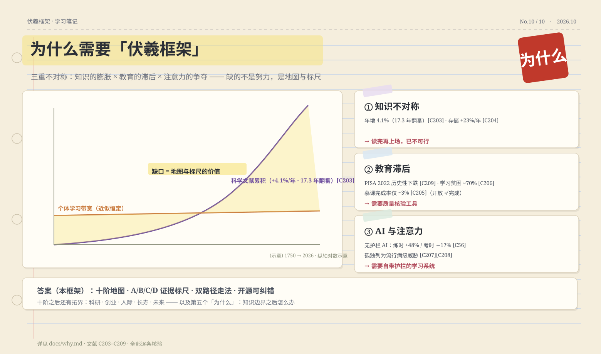
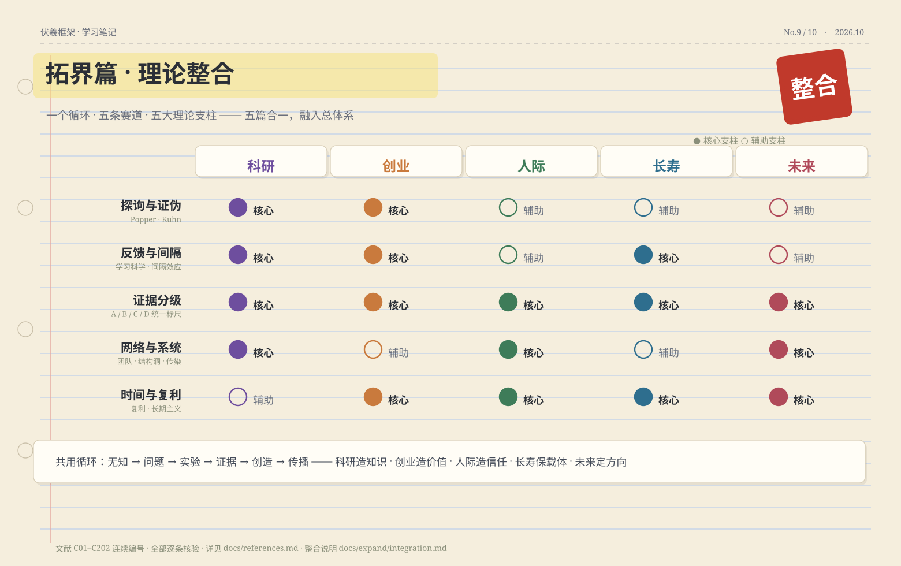

# 伏羲框架 · 万物皆可学
> 把「学会一样东西」拆成一条十阶时间线：每一阶给出最合适的方法 × 证据等级 × 开源工具 × 过关测试。
> 在线版（持续迭代）：https://HuanMoovo.github.io/fuxi/ ｜ 文档总目录：docs/README.md
> 许可：文档 CC BY 4.0 · 代码 MIT ｜ 全部文献可核验（C01–C286）

# 目录

# 编者的话：为什么是这四十多页

这本书是「伏羲框架」的精读入口：把你从「收藏夹里 100 个技巧、却不知道该用哪个」带到「一条清晰的十阶路线 + 一张证据地图」。

三点说明：
1. **本书是精简版**：完整版包含 11 个阶段详解、53 个理论框架、50+ 个方法卡、24 条误区考证与 286 条文献——全部开源在 GitHub，可在线检索。
2. **每一句主张都可核验**：文中 [Cxx] 编号对应书末精选文献与线上全量文献库；任何数字都能追到原文。
3. **读法**：先读第一章建立「为什么」，第二章当总目录随时跳转；第三章是上手清单；第四至六章按兴趣深入。

# 第一章 为什么需要这个框架

## 1.1 三重不对称：这个时代的学习困境

**知识在膨胀**：科学文献以年复合约 +4.1% 的速度增长、约 17.3 年翻一番（战后阶段更快）[C203]；全球存储容量 1986–2007 年间以约 +23%/年增长 [C204]。没有任何人的学习带宽在同步变宽——「读完再上场」的策略已经破产：正确的应对不是读得更快，而是携带地图（顺序）与过滤器（证据分级）。

**教育在滞后**：2022 年 PISA 显示多国数学与阅读出现历史性下滑 [C209]；中低收入国家约 70% 的 10 岁儿童读不懂简单短文 [C206]；大规模开放在线课程的证书完成率长期停留在约 3% 的量级 [C205]——「开放」不等于「完成」。等待教育系统更新不足以应对个人处境，需要「自建学习系统」+「质量核验工具」的组合。

**AI 是双刃剑**：无护栏使用生成式 AI，练习期表现 +48%、撤掉后考试 −17% [C56]；而带护栏的 AI 导师实验让学习显著提速（学习增益 0.73–1.3 SD，用时更少）[C59]。差别不在 AI，而在使用协议。

## 1.2 四个论点（对应四篇深度剖析）

1. **方法碎片化**：每个技巧都带条件、剂量与顺序，短视频剥掉这些只剩口号——解药是框架层认知（先知道「何时用哪个」，再谈执行）。
2. **伪科学横行**：学习金字塔、学习风格匹配、速读等六大神话仍在传播；真正高效的方法（检索练习、间隔重复）反而被冷落 [C05][C214][C215]。判断任何学习主张，先跑「60 秒鉴别 SOP」：一手来源？对照组？可复现？谁在卖？
3. **爽感陷阱**：重读、划线、看视频让人「感觉在学」，延迟测验一做就露馅——流畅感是骗子，测验才是裁判 [C01][C220]。
4. **AI 时代的新风险**：认知卸载、幻觉、自动化偏误、评价失效、认知分层五重风险——把「独立尝试 → AI 质询 → 脱稿复现」写进每一阶 [C56][C222][C224]。

## 1.3 设计四原则

**地图优先**（十阶时间线回答「何时用哪个」）· **证据分级**（每个方法标 A/B/C/D：A 强 / B 中 / C 弱-条件 / D 证伪）· **AI 有护栏**（三步协议）· **开源可纠错**（CC BY 4.0，错误公开修正）。

## 1.4 四篇深度剖析摘要

**① 方法碎片化**：技巧常被剥掉条件与顺序后传播。对照实验与元分析给出的「效用三档」决定了该用谁：检索练习、分散练习属高效用；划线、重读属低效 [C05]。框架层的价值是告诉你「何时用哪个」。

**② 伪科学横行**：神经神话在教师群体中广泛存在（左右脑、10% 大脑等）[C216]；「加脑科学词更可信」是实验证实的人性弱点 [C217]。防御武器是一个固定的鉴别流程，而不是更多信任。

**③ 爽感陷阱**：学习时越「顺畅」越要警惕——元认知监控失准让熟悉感冒充掌握 [C220]；合意困难研究表明短期的「费劲」与长期保持正相关 [C219]。

**④ AI 时代的新风险**：认知卸载让能力在没有护栏时退化 [C222]；幻觉是结构性问题 [C224]；自动化偏误让人减少检查 [C225]。唯一解是把「独立尝试→质询→脱稿复现」写死成协议。

# 第二章 十阶时间线：完整地图

## 2.1 总览表

| 阶段 | 一句话目标 | 核心方法 | 证据 |
|---|---|---|---|
| ① 立志 | 一页学习契约 | 目标层级 · 执行意图 | B |
| ② 建图 | 一页领域地图 | 三进路（发展史/对比/顶点倒推） | B |
| ③ 拆解 | 原子清单 + 练习动作 | 组块化 · 技能分解 | B |
| ④ 编码 | 最简解释 + 第一批卡 | 自我解释 · 生成效应 | A/B |
| ⑤ 检索 | 合上书先回忆 | 检索练习 · 抽认卡 | A |
| ⑥ 间隔 | 有序复习计划 | FSRS 调度 · 扩展间隔 | A |
| ⑦ 精练 | 能力边缘反复练 | 刻意练习 · 合意困难 | B |
| ⑧ 应用 | 真实项目干中学 | 做→卡→查→回填 | B |
| ⑨ 教学 | 讲给别人听 | 费曼式讲解 · 同伴教学 | A/B |
| ⑩ 维护 | 长期运转的系统 | 习惯 · 睡眠 · 运动 | A |
| ⑪ 拓界 | 走到知识边界之后 | 科研方法 + 五大赛道 | B |

## 2.2 第①阶 · 立志：一页学习契约

**目标**：把「想学 X」变成可执行的承诺。**核心动作**：写下「学成什么样算成功」（可验证的产出）+ 期限 + 每周固定时段；用「如果〈情境〉，就〈动作〉」把计划挂到固定线索上（执行意图，元分析 A 级 [C253]）。**过关自测**：能一句话说出目标、验收标准与时间预算。**常见错用**：目标是「学好英语」这类无法验收的愿望；计划没挂在具体时间地点上。

## 2.3 第②阶 · 建图：一页领域地图

**目标**：先知道森林在哪，再进树。**核心动作**：用三种进路任一画出骨架——发展史（时间线）、对比（同类并列）、顶点倒推（从高手在做什么反推知识树）；标出 5–9 个组块与前置关系。**过关自测**：合上资料，能向别人讲出这个领域的 5 个核心概念及其关系。**常见错用**：直接钻进第一个教程就开始学；地图追求完美而不开始。

## 2.4 第③阶 · 拆解：原子清单 + 练习动作

**目标**：把大技能拆到「一次练得动」。**核心动作**：拆成 15–60 分钟可完成一次的原子动作，按依赖排序；每个原子动作配一个明确练习。**过关自测**：清单里每一项都能在一小时内完成一次完整练习并知道对错。**常见错用**：拆得太粗（「练口语」）或太细（无法拼装）。

## 2.5 第④阶 · 编码：最简解释 + 第一批卡片

**目标**：把新知识编码成「可提取」的形式。**核心动作**：对每个概念写最简解释（用自己话讲给外行）；主动问「为什么成立 / 和什么相似 / 怎么不同」（精细提问）；先自己写答案再对照（生成效应 [C02]）；图文对照（双重编码 [C20]）。**过关自测**：能给外行讲懂 3 个核心概念。**常见错用**：抄书当编码；把「看过」当「编过」——检验标准是能否脱稿讲出来。

## 2.6 第⑤阶 · 检索：合上书先回忆

**目标**：用「取出」代替「再存入」。**核心动作**：学完立即合上材料，空白纸写/说全部能回忆的内容，再对照补缺；卡片一题一面（正面问题、背面答案）。**过关自测**：当天内容通过「空白纸回忆」测试（能写出 ≥70% 要点）。**常见错用**：只重读不复述；卡片越做越厚、复习只浏览不测验。[C01][C02]

## 2.7 第⑥阶 · 间隔：在快忘记时复习

**目标**：让记忆以最小成本存留最久。**核心动作**：把复习时点交给调度算法（如 FSRS），间隔随记忆强度扩展；考前分散到多天而非最后两晚猛攻。**过关自测**：连续 2 周按计划复习，完成率 > 80%。**常见错用**：每天固定复习全部卡片（低效）；临时抱佛脚（集中学习长期保持差）。[C04]

## 2.8 第⑦阶 · 精练：能力边缘反复练

**目标**：把「会」推到「熟」与「准」。**核心动作**：刻意练习四要素——明确子目标、在能力边缘、即时反馈、重复修正 [C31][C32]；混合题型与变式练习（交错，元分析支持 [C263]）；主动制造「合意困难」（拉长间隔、减少提示），但困难必须服务于检索与区辨 [C219]。**过关自测**：弱项在延迟测试中提升可观察。**常见错用**：舒适区重复一万小时；把「难受」当有效。

## 2.9 第⑧阶 · 应用：真实项目干中学

**目标**：让知识在真实场景中「长住」。**核心动作**：做真实项目，「做 → 卡 → 定向查学 → 回填」循环；任务尽量贴近真实使用场景（情境认知）；给新手保留保底脚手架，随熟练撤掉（示范淡出 [C81]）。**过关自测**：产出一个可展示的作品/交付物。**常见错用**：等「学完」再动手（无限期拖延）；只做教程题不做真项目。

## 2.10 第⑨阶 · 教学：教是最高级的学

**目标**：用输出倒逼输入。**核心动作**：脱稿讲给别人（或录音自讲），卡壳处即漏洞，补上再讲一遍 [C25][C19]；同伴教学：概念题先各自作答 → 讨论 → 再作答（收益显著 [C256]）。**过关自测**：完成一次 ≥10 分钟脱稿讲解并回复他人提问。**常见错用**：照着稿念；只讲给自己听从不接受提问。

## 2.11 第⑩阶 · 维护：让系统长期运转

**目标**：把学习变成可持续的日常。**核心动作**：固定线索 + 最小启动动作养成习惯 [C260]；睡眠 7–9 小时规律（学习环节而非奢侈品 [C261]）；每周 150 分钟运动 + 2 次力量（认知投资 [C262]）；每周 10 分钟复盘：完成率 / 卡点 / 下周调整。**过关自测**：连续 4 周系统未断链。**常见错用**：靠意志力硬撑；熬夜换时长。

## 2.12 第⑪阶 · 拓界：知识边界之后

**目标**：从「学人类已知」进入「探索人类未知」。**核心动作**：先写「无知清单」（你不知道自己不知道的东西 → 通过综述与专家访谈挖出）；用四矿脉找真问题（争议 / 断裂 / 工具 / 迁移）；证伪优先于证实。**过关自测**：提出一个可检验的新问题，并给出第一版实验设计。**常见错用**：追热点不做文献；问题大到无法检验。

## 2.13 三条路线适配（先回答两个问题）

> 有截止日吗？有交付目标吗？——据此分配各阶段权重。

| 路线 | 适用情境 | 重心阶段 |
|---|---|---|
| 探索轨 | 无目标、想了解 | 建图 → 拆解 → 编码 → 检索 |
| 实战轨 | 有交付目标 | 立志 → 拆解 → 精练 → 应用 |
| 冲刺轨 | 有截止日期 | 立志 → 检索 → 精练（考前计划）|

# 第三章 十二张方法卡（先学这十二个）

**① 检索练习（A）**：合上材料写/说出全部能回忆的内容，再对照补缺。原理：提取本身会加固记忆 [C01]。常见错用：只重读不复述。

**② 间隔重复（A）**：把复习交给调度算法（FSRS），间隔随记忆强度扩展；目标保持越久、间隔越长 [C04]。常见错用：每天固定复习全部。

**③ 自我解释（A）**：学每一步时自问「为什么成立」并写下答案 [C19]。常见错用：只看不想，把「看懂」当「学会」。

**④ 生成效应（A）**：先自己写出答案再看解析，让大脑先「生成」再校对 [C02]。常见错用：先看答案再假装自己也会。

**⑤ 精细提问（B）**：对每条新知识主动问「为什么」（elaborative interrogation）与「和什么相似/不同」[C05]。常见错用：只求记住原文措辞。

**⑥ 双重编码（B）**：文字配结构图，图上必须有关系标注（不是装饰画）[C20]。常见错用：画漂亮的思维导图但从不回看。

**⑦ 示范题与淡出（B）**：新手先完整看一个样例，再逐步撤掉辅助自己做 [C81]。常见错用：一上来就硬做题、卡死崩溃。

**⑧ 刻意练习（B）**：明确子目标 + 在能力边缘 + 即时反馈 + 重复修正；领域不同效应不同（教育领域约 4% 方差）[C32]。常见错用：舒适区重复、无反馈硬练。

**⑨ 合意困难（B）**：让提取「稍微费力」——拉长间隔、交错题型、减少提示；困难必须服务于检索与区辨 [C219]。常见错用：把任何痛苦都当有效。

**⑩ 迁移设计（B）**：练习覆盖变式与跨情境；近迁移易、远迁移难，需要刻意设计 [C244]。常见错用：同一题型刷到熟，换个场景就废。

**⑪ 同伴教学（A）**：概念题先各自作答 → 同伴讨论 → 再作答；讨论前必须先独立思考 [C256]。常见错用：直接抄别人的答案参与讨论。

**⑫ AI 护栏三协议（强制）**：先独立尝试（哪怕错）→ 再让 AI 质询/找错/出题 → 最后脱稿复现才算学会 [C56][C59]。常见错用：直接要答案、把 AI 当代笔。

# 第四章 拓界篇：知识边界之后

科研不是终点而是起点：当你把「无知清单」写得足够具体，课题自会浮现。五个方向共用同一条创造循环——无知 → 问题 → 实验 → 证据 → 创造 → 传播。

## 4.1 科研：把未知变成公共知识

- 从「无知清单」到「四矿脉」找真问题：争议点 / 断裂带 / 新工具能解的老题 / 跨领域迁移 [C113][C114]。
- 组队是默认策略：高影响论文中团队署名占比持续上升 [C185]；非常规组合出高影响——新颖度要配比适度 [C186]。
- 提交与传播：预注册、开放数据、主动寻找反例与复现 [C285]。

## 4.2 创业：把创造变成产品与组织

- Mom Test 三原则：只问过去行为、问生活不问点子、少说多听 [C123 系]；MVP 的使命是「证伪一个关键假设」。
- PMF 判据看留存与口碑；「40% 非常失望」可作量化红线（Sean Ellis 测试）[C158 区域]。
- 创始人不年轻：高增长公司创始人平均 40+ 岁 [C125]；创业者承担不可分散风险，先定「可承受损失」[C190]。
- 双轨战略：需求可辨用「预测法」，高度不确定用「创造法」（试错、联盟、控制损失）[C188]。

## 4.3 人际：把关系当系统经营

- 四类经典模型：成人依恋四类型 / 爱情三角 / 强弱连接 / 互惠博弈 [C130][C131][C132][C133]。
- 「末日四骑士」（批评/鄙视/辩护/冷战）预测关系解体；**修复尝试**是关键变量 [C135]。
- 社会连接是健康因子：148 项研究，社会关系强的人存活率高约 50% 量级 [C136]。
- 弱连接给机会、强连接给信任：刻意经营「桥」的位置（结构洞）[C132][C164]。

## 4.4 长寿：把身体当基础设施

- 衰老有十二大标志（2023 扩展版）[C138]；把筹码押在 A 级因素：不吸烟、运动（死亡风险 −30~40% [C139]）、睡眠 7–9 小时（短睡风险 +12% 量级 [C140]）、地中海饮食（PREDIMED RCT 心血管事件显著下降 [C141]）、社交连接 [C136]。
- 「蓝区」极端长寿叙事有记录质量争议 [C142]；抗衰补剂与换血疗法证据等级 C/D——别做。
- 规律性 > 时长：睡眠规律与死亡风险的关联强于睡眠时长 [C197]。

## 4.5 未来：把世界地图更新到 2045

- 先学「怎么判断预测」：超级预测三件套——分层校准 + 基础率 + 频繁小步更新 [C151]；情景规划找「无后悔动作」。
- 六大前沿科学雷达（2026–2045）：人工智能 [C144] / 生物技术 [C145] / 聚变能源 [C146] / 健康老龄化 [C150] / 气候系统 [C148] / 空间制造。
- 宏观基础率：人口 2080 年代达峰约 103 亿 [C147]；每 +0.5°C 风险上台阶 [C148]；治理走向「竞争性共存」[C149]。

# 第五章 理论框架与方法全景（速查）

## 5.1 理论框架全景（全量 53 个）

> 含思维与推理族；每个框架的详细展开见线上 [理论框架全景]。

| 框架 | 一句话 | 文献 |
|---|---|---|
| 信息加工模型 | 学习是「注意 → 工作记忆加工 → 长时记忆储存/提取」的链条 | C239(现代工作记忆综述) |
| 工作记忆容量有限 | 同时加工的新信息单元只有几个（数量级：4 个组块上下） | C238 |
| 认知负荷理论 | 教学设计的关键是管理内在/外在/相关三类负荷 | C81 Sweller 1988；C15 2019 |
| 双重编码 / 多媒体学习 | 言语 + 图像双通道编码更牢（需遵循多媒体设计原则） | C20 Paivio & Mayer |
| 图式理论 | 新知识挂到已有图式上才可记可用 | C240(含 Bartlett 传统的现代综述) |
| 间隔效应 | 分散学习稳健优于集中学习（最稳的实证规律之一） | C04 Cepeda 2006 |
| 检索练习（测试效应） | 从记忆中「取出」比「存入」更能加固记忆 | C01C02C243(元分析) |
| 合意困难 | 让提取「稍微费力」的设计提升长期保持 | C219 Bjork & Bjork |
| 迁移 | 学习的终点是迁移；近迁移易、远迁移难，需刻意设计 | C244(迁移分类学) |
| 生成学习 | 学习者必须主动生成意义（总结/图示/解释）而非被动接收 | C241；C23 Fiorella & Mayer |
| 自我解释 | 对自己解释「为什么」是最高效的加工之一 | C19 Bisra 元分析 |
| 示范题与淡出 | 新手先看完整样例，再逐步撤去辅助 | C81C15 |
| 掌握学习 | 达到掌握标准才进入下一单元 | C65 Bloom 2σ |
| 智能辅导系统 | 一对一辅导的机器实现，效果接近人类导师 | C248；C59 Kestin |
| 主动学习 | 课堂加入主动参与环节显著提升 STEM 表现 | C249(PNAS 元分析) |
| 反馈理论 | 反馈是强效杠杆，但类型决定效果（任务/过程层 > 自我层） | C258；C259 |
| 刻意练习 | 有目标、有反馈、在能力边缘的反复训练是专长核心（领域依赖） | C31C32 |
| 认知学徒 / 项目式学习 | 真实任务 + 师傅带 + 问题驱动的完整情境 | C44C45 |
| 自我调节学习（SRL） | 学习 = 计划 → 执行 → 监控 → 反思的循环 | C210 Zimmerman |
| 元认知 | 对自身认知的监控与调控（判断、校准、策略选择） | C242；C220 |
| 自我决定理论（SDT） | 自主 / 胜任 / 联结三种需求满足 → 内在动机 | C250 |
| 期望-价值理论 | 动机 = 期望（我能行）× 价值（这值得） | C251 |
| 目标设定理论 | 具体且有难度的目标优于「尽力而为」 | C252 |
| 执行意图 | 「如果 X 就做 Y」把意图转化为行动 | C253(元分析) |
| 习惯回路 | 情境线索驱动的自动化行为，替代意志力 | C260 |
| 建构主义 / 社会文化理论 | 知识在已有经验上建构；能力先在协助下达成（ZPD） | C246；C247 |
| 情境认知 | 学习离不开情境，「学校知识」与「使用知识」会断裂 | C245 |
| 合作学习 | 结构化合作学习有稳定正效应（需设计与分工） | C257(元分析) |
| 同伴教学 | 概念题先各自作答 → 同伴讨论 → 再答，收益显著 | C256 |
| 睡眠与记忆巩固 | 睡眠期间大脑进行记忆巩固与重组 | C261 |
| 运动与认知 | 心肺适能与认知功能、脑结构健康相关 | C262 |
| 关联主义 | 知识分布在网络中，学习 = 建立与维护连接（**主张有争议、实证薄弱，谨慎使用「理论」头衔**） | C254 |
| 第一性原理推理 | 流行提法；学术对应：专家以**深层原理**组织问题表征，从基本约束自下而上推导，而非套用类比 | C264；C265(专家-新手研究) |
| 类比推理（结构映射） | 类比的关键是**关系结构**对齐，不是表面相似；类比可训练 | C266；C267(类比编码训练) |
| 心智模型 | 人用内部简化模型做预测；学习=不断预测-打脸-修正模型 | C268 |
| 双重加工（快/慢系统） | 直觉（快）与审慎（慢）两套系统；高风险判断需强制慢通道 | C269；C270 |
| 批判性思维 | 可教；**对话/论辩式**教学的效果优于单纯讲授 | C271(元分析) |
| 因果推理 | 人天然做因果推断，但常混淆相关与干预 | C272 |
| 有限理性与启发式 | 简单规则在真实不确定环境中常表现优异——「偏差」不是全部故事 | C273 |
| 科学方法论（假说-检验） | 知识靠可反驳的假设与检验前进 | C113 Kuhn；C114 Popper(既有编号) |
| 演绎推理（反例搜索） | 有效推理 = 系统性搜索「结论为假」的模型；推理错误多来自只建构了单一情境 | C274 |
| 归纳与抽象 | 心智是「统计推断器」：从少量样本推断生成结构 | C275 |
| 贝叶斯推理与自然频率 | 把条件概率改写成**自然频率**（每 1000 人里……）可大幅提升判断正确率 | C276 |
| 前景理论（风险决策） | 人对损失比对等量收益敏感；决策取决于参考点与框架 | C277 |
| 博弈与策略思维 | 重复互动中「友善-可报复-宽容」的以牙还牙型策略稳健占优 | C278 |
| 系统思维（反馈与延迟） | 复杂系统的反馈延迟会让直觉判断系统性出错 | C279 |
| 创造性思维（发散与生成） | 发散思维可测可训，与创造潜能相关；创造=类比/组合/抽象等生成过程 | C280；C281 |
| 设计思维 | 问题定义 → 发散 → 原型 → 测试的迭代流程（教育应用证据中等） | C282 |
| 统计素养（p 值） | p 值不是「证据强度打分」；不显著 ≠ 无效应 | C284；C283 |
| 开放科学与可重复性 | 预注册、数据开放、复现研究是方法论标准 | C285 |
| 文化认知（整体/分析） | 东亚思维偏整体关系、西方偏分析对象——实验可测的文化差异 | C286 |
| 去偏差训练 | 一次性结构化训练可改善偏差判断且效果持续 | C287 |
| 概率预测与校准 | 分层校准 + 基础率 + 频繁小步更新显著优于直觉预测 | C151(既有编号) |

## 5.2 学习方法全景（全量 55 个）

| 阶段 | 方法 | 等级 | 文献 |
|---|---|---|---|
| ①-③定向/建图与拆解 | 具体目标设定 | A | C252 |
| ①-③定向/建图与拆解 | 执行意图 | A | C253 |
| ①-③定向/建图与拆解 | 领域地图三进路 | B | 本项目整理（框架层[^1） |
| ①-③定向/建图与拆解 | 组块化拆解 | B | C17 Chase & Simon |
| ①-③定向/建图与拆解 | 依赖排序 | B | 本项目整理 |
| ①-③定向/建图与拆解 | 时间预算 | C | 本项目整理（SRL 环） |
| ④ 编码 | 自我解释 | A | C19 |
| ④ 编码 | 精细提问 | B | C05 |
| ④ 编码 | 生成效应 | A | C02C23 |
| ④ 编码 | 双重编码 | B | C20 |
| ④ 编码 | 示范题 + 淡出 | B | C81C15 |
| ④ 编码 | 概念图 | B | C41 |
| ④ 编码 | 关键词记忆术 | C（低效用警示） | C05 |
| ⑤ 检索 | 自由回忆 | A | C01C243 |
| ⑤ 检索 | 抽认卡 + 调度 | A | C02C04 |
| ⑤ 检索 | 交错练习 | A | C263 |
| ⑤ 检索 | 延迟判断 | B | C220 |
| ⑤ 检索 | 错题重测 | B | 本项目整理（复合已证方法） |
| ⑥ 间隔 | 间隔重复 | A | C04 |
| ⑥ 间隔 | 与睡眠对齐 | B | C261 |
| ⑥ 间隔 | 考前分散计划 | A | C04 |
| ⑦ 精练 | 刻意练习 | B（领域依赖） | C31C32 |
| ⑦ 精练 | 变式练习 | A | C263 |
| ⑦ 精练 | 合意困难调节 | B | C219 |
| ⑦ 精练 | 反馈循环 | A | C258C259 |
| ⑦ 精练 | 难度爬坡 | B | C15 |
| ⑧ 应用（干中学） | 真实任务干中学 | B | C44 |
| ⑧ 应用（干中学） | 项目式学习 | B | C45 |
| ⑧ 应用（干中学） | 主动式工作坊 | A | C249 |
| ⑧ 应用（干中学） | 情境任务设计 | B | C245 |
| ⑧ 应用（干中学） | 公开输出 | C（实践验证） | 本项目整理 |
| ⑨ 教学（教是最高级的学） | 教中学 / 费曼式讲解 | B | C25C19 |
| ⑨ 教学（教是最高级的学） | 同伴教学 | A | C256 |
| ⑨ 教学（教是最高级的学） | 合作学习 | B | C257 |
| ⑨ 教学（教是最高级的学） | 导师 / 智能辅导 | A | C65C248C59 |
| ⑩ 维护 | 习惯设计 | B | C260 |
| ⑩ 维护 | 睡眠 | A | C261 |
| ⑩ 维护 | 运动 | A | C262 |
| ⑩ 维护 | 周复盘 | B | C210 |
| ⑩ 维护 | 环境设计 | C | 本项目整理 |
| 横切元技能 | 迁移设计 | B | C244 |
| 横切元技能 | 元认知监控 | B | C242C220 |
| 横切元技能 | 动机设计 | B | C250C251 |
| 横切元技能 | 分类学自检 | B | C255 |
| 横切元技能 | 原理推导练习 | B | C264C265 |
| 横切元技能 | 类比编码 | B | C266 |
| 横切元技能 | 批判性思维训练 | A | C271 |
| 横切元技能 | 因果图梳理 | B | C272 |
| 横切元技能 | 判断复核 | B | C269C270 |
| 横切元技能 | 自然频率换算 | B | C276 |
| 横切元技能 | 反例搜索 | B | C274 |
| 横切元技能 | 发散→收敛循环 | B | C280C282 |
| 横切元技能 | 系统回路图 | B | C279 |
| 横切元技能 | 统计素养三问 | B | C284C283 |
| 横切元技能 | 去偏差清单 | B | C287 |

# 第六章 误区 24 条速查 + 六条详解

## 6.1 速查表

| 说法 | 真相 | 等级 |
|---|---|---|
| 学习风格匹配 | 无证据支持匹配增益 | D |
| 学习金字塔 | 数字无原始出处 | D |
| 重读/划线有用 | 低效用，只能热身 | D |
| 速读（高速+高理解） | 与阅读科学不符 | D |
| 一万小时定律 | 质量×反馈的函数 | D |
| 脑训练游戏提升智力 | 远迁移为零 | D |
| 成长型思维万能 | 证据支持条件性小效应 | C |
| 考前突击 | 集中学习长期保持差 | D |
| 边睡边学 | 编码需要清醒 | D |
| 遗忘=失败 | 遗忘是正常规律 | C |
| 多任务并行 | 切换代价+干扰同伴 | D |
| AI 全托管 | 撤离后表现下降 | D |
| 思维导图万能 | 证据有限、被营销夸大 | C |
| 先学完基础再动手 | 「学完」是无限期拖延 | C |
| 费曼技巧有原论文 | 后人的整理与命名 | C |
| 莫扎特效应 | 效应极小且可归因于唤醒 | D |
| 左右脑/10% 大脑 | 神经神话，无科学支持 | D |
| 关键期绝对化 | 渐变的敏感期非开关 | B |
| 手写必然优于打字 | 直接复现未发现优势 | C |
| 抽认卡只配死记 | 测试效应可迁移 | B |
| 补脑保健品 | 健康人无可靠证据 | C |
| 阅读障碍=看反字 | 神经发育性障碍 | D |
| 男生理科脑 | 性别差异极小且波动 | D |
| 合意困难=越难受越好 | 困难必须服务检索/区辨 | C |

## 6.2 六条详解

**学习金字塔（D）**：那张「听讲记住 5%、教别人记住 90%」的图，全部数字找不到原始出处——属以讹传讹 [C52]。要排序就用有证据的结论：检索练习与分散练习属高效用 [C05]。

**成长型思维（C）**：先承认合理部分——相信能力可发展有正面价值；但边界明确：两次元分析显示总效应很小，主要在有支持环境的中低成就学生中可见 [C21 区域]。当低成本补充可以，当万能钥匙不行。

**关键期（B）**：敏感期真实存在——第二语言语法能力约 17.9 岁前保持高位后开始下降 [C230]；但它是渐变的斜坡而不是开关，成人仍可以达到高水平（只是达标率下降）。

**手写 vs 打字（C）**：原始研究提示手写促进概括；但直接复现未发现手写优势，小元分析效应也极小 [C231]。决定因素是「你做了多少生成性加工」，不是工具本身。

**抽认卡只配死记（B）**：测试效应可迁移到新情境与新题型（虽小于直接效应）[C232]；把卡片升级为「应用卡/为什么卡」，理解类目标同样受益 [C233]。

**合意困难≠越难受越好（C）**：合意困难指特定设计——提取费力、间隔、交错、变式——服务「检索」与「区辨」两类加工；缺输入、烂材料、无序练习只会伤害学习 [C219]。

## 6.3 自查八问

① 上次学习结束有做空白纸回忆吗？② 用「我是视觉型」做过决定吗？③ 复习由工具调度还是心情？④ 撤掉 AI 能独立复现吗？⑤ 「等基础学完」说了多久？⑥ 判断「困难」看它练什么还是多难受？⑦ 用莫扎特/右脑类说法指导过学习投资吗？⑧ 校验过自己的 AI 用法符合三步协议吗？

# 第七章 结语：从这里出发

- 在线主页：https://HuanMoovo.github.io/fuxi/
- 文档总目录：https://github.com/HuanMoovo/fuxi/blob/main/docs/README.md
- 全量文献库：https://github.com/HuanMoovo/fuxi/blob/main/docs/references.md
- 图表生成器（可复现）：generator/build_svgs.py ｜ 本书生成器：generator/build_book.py

框架自己接受评判：发现错误欢迎提 Issue——错误被公开修正，本身就是这套方法的演示。
# 第八章 附录（即用工具）

## 附录 A · 立即开始（30 分钟行动版）

1. **5 分钟**：从上面的表格里选一条路线，记下你的重心阶段。
2. **10 分钟**：填一份 [学习契约](./templates/learning-contract.md)（目标只写 3 个可验证结果）。
3. **10 分钟**：画一版 [领域地图草稿](./docs/stages/02-map.md)（丑没关系，结构比美观重要）。
4. **5 分钟**：为今天学的 1 个知识点做 [3 张卡片](./templates/card-rules.md)，装进 [Anki + FSRS](https://github.com/open-spaced-repetition/fsrs4anki)。
5. **明天**：开始 25 分钟/天的[极简节律](./docs/paths.md#4-每日--每周节律样板)，一周后做第一次空白纸回忆。

---

## 附录 B · AI 副驾协议

> AI 是本框架的加速器，但用错方向会变成学习毒药（[Bastani 2025](https://www.pnas.org/doi/10.1073/pnas.2422633122)｜[Fan 2025](https://bera-journals.onlinelibrary.wiley.com/doi/10.1111/bjet.13544)｜[Kosmyna 2025 预印本](<https://web.archive.org/web/20250601000000/https://www.media.mit.edu/publications/your-brain-on-chatgpt/>)）。

1. **顺序铁律**：先自己产出（解释/答案/方案），再让 AI 挑错 —— 不许反过来。
2. **检索期**：只让 AI 当考官出题、追问，**不索取答案**。
3. **角色定位**：AI 是陪练、考官、反方、小白学生，不是代笔者。
4. **核验义务**：AI 给的任何数字/引用，回原始来源核对后才有资格进你的笔记。
5. **撤离测试**：阶段性做「无 AI 延迟测验」——撤掉拐杖还能走，才叫学会。
6. **省脑审计**：记录哪些环节被 AI 省掉了脑子 —— 那正是你要补练的靶子。
7. **工具选择**：本地/开源优先（[Ollama](<https://github.com/ollama/ollama>)/[llama.cpp](<https://github.com/ggml-org/llama.cpp>)），数据可控、可离线。

> 正面样板：设计良好的 AI 导师可带来 0.73–1.3 SD 的学习增益且更省时（[Kestin et al., 2025, Scientific Reports](<https://doi.org/10.1038/s41598-025-97652-6>)）—— 关键在「设计」，不在「有无 AI」。

---

## 附录 C · 可打印模板

### C1 学习契约
# 《学习契约》模板

> 第 1 阶 · 立志（Orient）的产出物。填完一页纸，放在你每天看得见的地方。
> 用法：先自己填；可让 AI 扮演教练追问（追问可以，代填不行——警惕依赖与「元认知懒惰」风险 [C57]）。

## 契约正文

**领域**：________
（一句话写清要学什么，具体到能判断某个内容「在不在范围内」。）

**为什么学（动机）**：________
（写 1–3 条真实理由：想让什么变好、想用在哪里；能说出的「为什么」才靠得住。）

**三个可验证的结果（含完成标准）**：

| # | 结果 | 完成标准（别人拿什么检验） |
|---|------|---------------------------|
| 1 | ________ | ________ |
| 2 | ________ | ________ |
| 3 | ________ | ________ |

（反例：「学好英语」；正例：「不查词典读完一本 ____ 难度的书，并写出摘要」。）

**截止与里程碑**：
- 总截止：____ 年 __ 月 __ 日
- 里程碑 1（__ 月 __ 日）：________
- 里程碑 2（__ 月 __ 日）：________
- 里程碑 3（__ 月 __ 日）：________

**每周固定时间块**：

| 星期 | 时间 | 地点 | 做什么 |
|------|------|------|--------|
| 周__ | ____ | ____ | 学新内容 |
| 周__ | ____ | ____ | 练习 / 实战 |
| 周__ | ____ | ____ | 复习 + 周检视 |

（写到日历里；时段具体到「几点到几点、在哪、做什么」。）

**失败预案（状态差时的保底动作）**：
- 状态差时，只做：________（最小动作，例如「过一遍当日复习卡」）
- 每周最多允许错过 __ 次；连续错过更多，就启动收缩：________（例如「两周内只保留复习」）

**复习承诺（用哪套间隔系统）**：
- 使用哪套：________（Anki + FSRS ／ Obsidian Spaced Repetition ／ Logseq ／ 纸卡与固定间隔）
- 每天固定 ____ 时过卡；不欠债超过 ____ 天。

**签署与日期**：
我，________，于 ____ 年 __ 月 __ 日签署本契约，并同意每月月底回看一次、必要时修订。

---

## 填写示例（精简版）——三个月学会数据分析基础

- 领域：数据分析基础——用表格与图表回答业务问题。
- 为什么学：工作周报靠手工贴数，想自己能独立完成一次完整分析。
- 三个可验证的结果：
  1. 用公开数据集完成 1 份分析报告（标准：含数据清洗、3 张图、1 条明确结论，同事能复述）；
  2. 独立写出 30 行以内的数据清洗脚本（标准：不看教程跑通，结果可复现）；
  3. 通过 1 次模拟答辩（标准：考官 10 问里答对 8 问）。
- 截止与里程碑：3 个月截止；第 1 月出报告初稿，第 2 月完成脚本，第 3 月通过答辩。
- 每周时间块：周二、周四 20:00–21:00 学新内容；周六 10:00–10:30 复习 + 周检视。
- 失败预案：状态差时只过 10 分钟复习卡；连续错过 3 天，收缩为一周只做周六复习。
- 复习承诺：Anki（FSRS），每天 20:30 过卡。
- 签署：________，____ 年 __ 月 __ 日。

> 依据：学习契约对应目标设定与反馈（B，[C36][C37]）；失败预案即执行意图（implementation intentions，if-then 计划；A/B，[C33]）。等级为本项目对现有证据的综合判断，非期刊官方评级。

### C2 周检视
# 《周检视》模板

> 每周固定一个时段填一次（建议放在周六复习之后），全程对照《学习契约》来写。
> 作用：把「感觉在学」换成看得见的数据。对应自我调节学习的自省环节（[C37]）。

## 1. 本周投入时长（计划 vs 实际）

| 项目 | 计划 | 实际 | 差额原因 |
|------|------|------|----------|
| 学新内容 | __ h | __ h | |
| 练习 / 实战 | __ h | __ h | |
| 复习 | __ h | __ h | |
| 合计 | __ h | __ h | |

## 2. 完成的事

- （对照契约的三个结果，写「推进了什么」；用产出物描述，不写「学习了 XX」。）
- ________

## 3. 最大卡点

- 卡点：________ ｜ 类别（概念／资源／时间／反馈）：____ ｜ 下一步动作：________

## 4. 错误日志摘要（分类统计）

| 类型 | 本周数量 | 典型 1 例 | 已安排复测？ |
|------|----------|-----------|--------------|
| 概念错 | | | |
| 程序错 | | | |
| 粗心 | | | |
| 记忆缺失 | | | |

（个案详情记在《错题日志》；这里只看结构——哪一类在变多。）

## 5. 下周 1 个实验性改进

- 只改一件事：________ → 观察指标：________（下周复盘它有没有用。）

## 6. 复习队列健康度

- 积压卡数：____（与上周比：增加／持平／减少）
- 留存率：____（对照目标线；在目标线附近即健康）
- 有无 Leech（反复忘记的顽固卡）：有／无 → 处理方式：________

## 7. 下周计划

- 里程碑检查：________（对照契约截止日；是否需要调整范围或时间块？）
- 下周重点（不超过 3 条）：
  1. ________
  2. ________
  3. ________

---

填写提示：
1. 先填数据，再写感受——时长、卡数用工具统计（如 ActivityWatch、Anki 统计），不凭记忆。
2. 卡点只写「能行动」的：把「学不会」改写成「卡在 X，下一步做 Y」。
3. 改进每周只留一个，连续 4 周健康再加下一个；实验太多等于无法归因。

### C3 错题日志
# 《错题日志》模板

> 第 7 阶 · 精练（Drill）的核心工具。硬性规则：每条记录必须走完「根因分析 → 修正动作 → 复测」闭环，缺一不算记录。
> 为什么值得：无反馈等于无精练；反馈要即时、具体、可行动、对事不对人（[C46][C47]）。

## 记录表

| 日期 | 情境 | 题目或错误 | 类型 | 根因分析 | 修正动作 | 复测日期与结果 |
|------|------|-----------|------|----------|----------|----------------|
| 2026-10-03 | 章节小测 | 把平均值当作中位数使用 | 概念错 | 两个概念的定义混在一起，没弄清各自的使用条件 | 重做 3 道含极端值的题；建卡「何时用中位数而非平均值」 | 10-05 ✓ 3/3 |
|  |  |  |  |  |  |  |
|  |  |  |  |  |  |  |
|  |  |  |  |  |  |  |

类型一栏只填四种：概念错｜程序错｜粗心｜记忆缺失。

## 根因分类说明

| 类型 | 典型表现 | 常见根因 | 修正方向 |
|------|----------|----------|----------|
| 概念错 | 用错定义、混淆近邻概念 | 理解没到位，边界不清 | 回第 4 阶重新编码：自我解释 + 反例 + 精细提问 |
| 程序错 | 步骤漏、顺序乱、方法不熟 | 流程未组块化，练得不够 | 拆成单个步骤慢练，再串回整体（第 3、7 阶） |
| 粗心 | 明明会却做错：看漏、抄错、算错 | 没有固定检查动作，或疲劳 | 加一个固定检查步骤；缩短单次练习时长 |
| 记忆缺失 | 想不起、记不全 | 检索次数不足，间隔安排不当 | 进复习队列增加检索；不要用重读安慰自己（[C05]） |

## 使用要点

- 「情境」是为日后复现：在哪、做什么、什么条件（限时吗、可查资料吗）。
- 复测失败不要只改日期：回到「根因分析」重判类型；同一条错反复出现，就该回炉更基础的原子（处理思路参考第 6 阶的 Leech 处理）。
- 周检视时只统计数量、不重写内容；月底回看一次「哪类错最多」，据此调整练习结构。

> 依据：错误日志与根因分类（B，工具方法）；反馈机制见（A，[C46][C47]）。等级为本项目对现有证据的综合判断，非期刊官方评级。

# 第九章 证据与文献

## 9.1 证据分级标准

**A 强**（多项元分析/RCT 方向一致）· **B 中**（有对照研究，受情境调节）· **C 弱/条件**（理论好、实证有限）· **D 证伪**（流行但被证据否定）。等级为本项目对证据的综合判断，非期刊官方评级；所有数字照转文献报告口径。

## 9.3 如何引用

HuanMoovo. 《伏羲框架 · 万物皆可学》. GitHub: https://github.com/HuanMoovo/fuxi （文档 CC BY 4.0）——引用格式见仓库 CITATION.cff。

## 9.2 精选文献（全量 C01–C286 见线上文献库）

- - [C01] Karpicke, J. D., & Roediger, H. L. (2008). The Critical Importance of Retrieval for Learning. *Science*, 319(5865), 966–968. ；<http
- - [C02] Roediger, H. L., & Karpicke, J. D. (2006). Test-Enhanced Learning. *Perspectives on Psychological Science*. ；<
- - [C03] Adesope, O. O., Trevisan, D. A., & Sundararajan, N. (2017). Rethinking the Use of Tests: A Meta-Analysis of Practice Testing. *Review of Educational Research*. <
- - [C04] Cepeda, N. J., et al. (2006). Distributed practice in verbal recall tasks. *Psychological Bulletin*, 132(3). ；
- - [C05] Dunlosky, J., et al. (2013). Improving Students' Learning With Effective Learning Techniques. *PSPI*.
- - [C09] Sinha, T., & Kapur, M. (2021). When Problem Solving Followed by Instruction Works: Evidence for Productive Failure. *RER*.
- - [C15] Sweller, J., van Merriënboer, J. J. G., & Paas, F. (2019). Cognitive Architecture and Instructional Design: 20 Years Later. *EPR*.
- - [C17] Chase & Simon (1973) Perception in chess；Cowan (2001) The magical number 4. ；
- - [C19] Bisra, K., et al. (2018). Inducing Self-Explanation: a Meta-Analysis. *EPR*.
- - [C20] Paivio, A. (1971). Imagery and Verbal Processes（书）；Mayer, R. E. (2009). Multimedia Learning（书）. ；
- - [C23] Fiorella, L., & Mayer, R. E. (2016). Eight Ways to Promote Generative Learning. *EPR*, 28(4).
- - [C25] Nestojko, J. F., et al. (2014). Expecting to teach enhances learning.
- - [C31] Ericsson, K. A., Krampe, R. T., & Tesch-Römer, C. (1993). The role of deliberate practice. *Psychological Review*.
- - [C32] Macnamara, B. N., Hambrick, D. Z., & Oswald, F. L. (2014). Deliberate Practice and Performance: A Meta-Analysis. *Psychological Science*.
- - [C41] Ausubel, D. P. (1960). Advance organizers；Novak & Cañas 概念图理论。 ；
- - [C44] Collins, A., Brown, J. S., & Newman, S. E. (1989). Cognitive Apprenticeship.
- - [C45] Dochy, F., et al. (2003). Effects of problem-based learning: A meta-analysis. *Learning and Instruction*.
- - [C51] Pashler, H., et al. (2008). Learning Styles: Concepts and Evidence. *PSPI*.
- - [C52] Letrud (2012) 与 Subramony et al. (2014)：学习金字塔/保持率锥系神话。 ；
- - [C53] Rayner, K., et al. (2016). So Much to Read, So Little Time. *PSPI*.
- - [C54] Sala, G., & Gobet, F. (2019). Near and Far Transfer in Cognitive Training. *Collabra*.
- - [C56] Bastani, H., et al. (2025). Generative AI without guardrails can harm learning. *PNAS*.
- - [C57] Fan, Y., et al. (2025). Beware of metacognitive laziness. *BJET*.
- - [C59] Kestin, G., et al. (2025). AI tutoring outperforms in-class active learning. *Scientific Reports*.
- - [C65] Bloom, B. S. (1984). The 2 Sigma Problem.
- - [C75] Roediger & Butler (2011) 检索练习的批判性回顾（TiCS）。
- - [C81] Sweller (1988) 认知负荷与示范题效应（原始论文）。
- - [C113] Kuhn, T. — The Structure of Scientific Revolutions（范式与反常）:
- - [C114] Popper, K. — 可证伪性与批判理性主义:
- - [C123] Camuffo et al. (2020). A Scientific Approach to Entrepreneurial Decision Making:
- - [C125] Azoulay et al. (2020). Age and High-Growth Entrepreneurship:
- - [C130] Hazan & Shaver (1987). Romantic love as attachment:
- - [C132] Granovetter (1973). The Strength of Weak Ties:
- - [C133] Nowak & Sigmund (2005). Evolution of indirect reciprocity:
- - [C135] Gottman Institute — Research:
- - [C136] Holt-Lunstad et al. (2010). Social Relationships and Mortality Risk:
- - [C138] López-Otín et al. (2023). Hallmarks of aging:
- - [C139] Moore et al. (2012). Physical activity and mortality:
- - [C141] Estruch et al. (2013). PREDIMED:
- - [C144] Stanford AI Index:
- - [C146] LLNL Fusion Ignition:
- - [C147] UN World Population Prospects:
- - [C148] IPCC AR6 SYR:
- - [C151] Tetlock et al. — Superforecasters:
- - [C203] Bornmann & Mutz (2015). Growth rates of modern science:
- - [C204] Hilbert & López (2011). The World's Technological Capacity:
- - [C205] Reich & Ruipérez-Valiente (2019). The MOOC Pivot（Science）:
- - [C206] World Bank — Learning Poverty:
- - [C207] WHO — Commission on Social Connection:
- - [C208] U.S. Surgeon General (2023). Our Epidemic of Loneliness and Isolation:
- - [C209] OECD (2023). PISA 2022 Results:
- - [C210] Zimmerman (2002). Becoming a Self-Regulated Learner:
- - [C214] Pashler et al. (2008). Learning Styles: Concepts and Evidence:
- - [C215] Rayner et al. (2016). So Much to Read, So Little Time:
- - [C216] Dekker et al. (2012). Neuromyths in Education:
- - [C217] Weisberg et al. (2008). The Seductive Allure of Neuroscience Explanations:
- - [C219] Bjork & Bjork (2011). Making Things Hard on Yourself, But in a Good Way:
- - [C220] Koriat & Bjork (2005). Illusions of Competence:
- - [C222] Ji et al. (2023). Survey of Hallucination in NLG:
- - [C224] Dell'Acqua et al. (2023). Navigating the Jagged Technological Frontier:
- - [C225] UNESCO (2023). Guidance for Generative AI in Education and Research:
- - [C226] Gerlich (2025). AI Tools in Society:
- - [C227] OpenAI et al. (2023). GPT-4 Technical Report:
- - [C228] Pietschnig, Voracek & Formann (2010). Mozart effect–Shmozart effect: A Meta-analysis:
- - [C230] Hartshorne, Tenenbaum & Pinker (2018). A Critical Period for Second Language Acquisition（Cognition）:
- - [C231] Urry et al. (2021). Don't Ditch the Laptop Just Yet: A Direct Replication（Psych Science）:
- - [C232] Pan & Rickard (2018). Transfer of Test-Enhanced Learning: Meta-Analytic Review（Psych Bulletin）:
- - [C233] Butler (2010). Repeated Testing Produces Superior Transfer of Learning（JEP:LMC）:
- - [C238] Cowan (2001). The Magical Number 4 in Short-Term Memory:
- - [C239] Baddeley (2012). Working Memory: Theories, Models, and Controversies（Annu Rev Psychol）:
- - [C240] van Kesteren et al. (2012). How Schema and Novelty Augment Memory Formation（TiCS）:
- - [C241] Wittrock (1974). Learning as a Generative Process:
- - [C244] Barnett & Ceci (2002). When and Where Do We Apply What We Learn?（迁移分类学）:
- - [C249] Freeman et al. (2014). Active Learning Increases Student Performance（PNAS）:
- - [C253] Gollwitzer & Sheeran (2006). Implementation Intentions and Goal Achievement（元分析）:
- - [C256] Smith et al. (2009). Why Peer Discussion Improves Student Performance（Science）:
- - [C258] Hattie & Timperley (2007). The Power of Feedback:
- - [C259] Wisniewski et al. (2020). The Power of Feedback Revisited（Frontiers）:
- - [C260] Wood & Neal (2007). A New Look at Habits and the Habit–Goal Interface:
- - [C261] Rasch & Born (2013). About Sleep's Role in Memory（Physiol Rev）:
- - [C262] Hillman, Erickson & Kramer (2008). Be Smart, Exercise Your Heart（Nat Rev Neurosci）:
- - [C263] Brunmair & Richter (2019). Similarity Matters: A Meta-Analysis on Interleaved Learning:
- - [C264] Chi, Feltovich & Glaser (1981). Categorization and Representation of Physics Problems:
- - [C265] Larkin et al. (1980). Expert and Novice Performance in Solving Physics Problems（Science）:
- - [C266] Gentner (1983). Structure-Mapping: A Theoretical Framework for Analogy:
- - [C269] Kahneman (2003). Maps of Bounded Rationality:
- - [C270] Evans & Stanovich (2013). Dual-Process Theories of Higher Cognition:
- - [C271] Abrami et al. (2015). Strategies for Teaching Students to Think Critically:
- - [C276] Gigerenzer & Hoffrage (1995). Bayesian Reasoning Without Instruction:
- - [C279] Sterman (2006). Learning from Evidence in a Complex World:
- - [C283] Amrhein et al. (2019). Scientists Rise Up Against Statistical Significance:
- - [C284] Wasserstein & Lazar (2016). ASA Statement on p-Values:
- - [C287] Morewedge et al. (2015). Debiasing Decisions:

