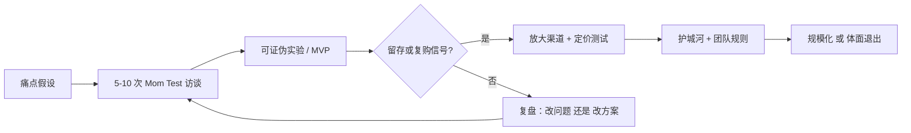

# 拓界篇 · 创业赛道：「把创造变成产品与组织」

> **何时进入**：当你手里有一个「值得被世界使用」的想法，或已在做产品 / 接单 / 独立开发。创业是用市场检验认知的最高强度实战 —— 科研创造知识，创业创造价值。
> 本页是 [第 11 阶 · 拓界](../stages/11-expand.md) 的五大赛道之一。

## 1. 底层逻辑：创业是可学的科学（等级 A）

- **科学方法训练有硬证据**：把创业决策写成「可检验假设 + 系统证据收集」的随机对照实验（759 家企业）显示，受训组 12 个月内**营收更高、转向（pivot）更及时**。[C123]
- **因果推理 vs 手段驱动**：Effectuation 研究（27 位专家创业者口头协议分析）表明高手**不是先定目标再找资源**，而是从「我是谁 / 我知道什么 / 我认识谁」出发，把意外当资源，先定**可承受损失**。[C124]
- **年龄真相**：对全美高增长初创的分析显示，创始人平均年龄约 42-45 岁，「年轻才配创业」是幸存者偏差。[C125]

## 2. 方法论主线（五步闭环）

1. **问题验证（Mom Test 三原则）**：只问过去行为，不问未来意愿；问他们的生活，不问你的点子；少说多听。[C128]
2. **MVP 与学习循环**：Build → Measure → Learn；每一次迭代必须能**证伪一个关键假设**。[C127]
3. **PMF（唯一重要的事）**：市场拉动 > 产品推动；判据是留存曲线走平与口碑增长，不是融资额。[C126]
4. **增长与护城河**：渠道 > 产品差异；网络效应 / 切换成本 / 规模经济三选一建壁垒；健康线：LTV > CAC、回本 < 12 个月。
5. **团队与失败复盘**：股权与决策规则前置；失败经验必须经过**结构化复盘**才能迁移（经验≠学习）。

## 3. 关键概念表

| 概念 | 一句话 | 常见误区 |
|---|---|---|
| PMF | 用户不请自来、留存走平 | 拿融资额当 PMF |
| MVP | 最小**可验证**切片 | 「能上线」才叫 MVP |
| 可承受损失 | 先定亏得起的上限 | 梭哈式 All-in |
| 渠道优先 | 「产品自己会说话」几乎不成立 | 打磨到完美再推 |
| 节奏 | 小步快跑 + 定期深潜 | 一年憋大招 |

## 4. 创业循环

## 5. 工具

- **[Chatwoot](https://github.com/chatwoot/chatwoot)** ★3.7万 — 开源客服与用户对话台（用户研究前线）。
- **[Formbricks](https://github.com/formbricks/formbricks)** ★1.3万 — 开源问卷与产品内调研（验证需求）。

## 6. 检验清单

- [ ] 完成 ≥10 个用户访谈（只问过去行为）；
- [ ] 至少一个关键假设被实验**证伪或证实**；
- [ ] 留存 / 复购数据连续 4 周可观察；
- [ ] 写下「可承受损失上限」与停止规则；
- [ ] ≥3 个渠道实验，至少 1 个跑通 LTV > CAC。

## 参考（创业赛道）

- [C123] Camuffo et al. (2020). A Scientific Approach to Entrepreneurial Decision Making（RCT）: <https://doi.org/10.1287/mnsc.2018.3249>
- [C124] Sarasvathy (2001). Causation and Effectuation（AMR）: <https://effectuation.org/>
- [C125] Azoulay et al. (2020). Age and High-Growth Entrepreneurship（NBER）: <https://www.nber.org/papers/w24489>
- [C126] Andreessen. The Only Thing That Matters（PMF 经典文）: <https://pmarchive.com/guide_to_startups_part4.html>
- [C127] Blank. Why the Lean Start-Up Changes Everything（HBR）: <https://hbr.org/2013/05/why-the-lean-start-up-changes-everything>
- [C128] Fitzpatrick. The Mom Test（官网）: <https://www.momtestbook.com/>
