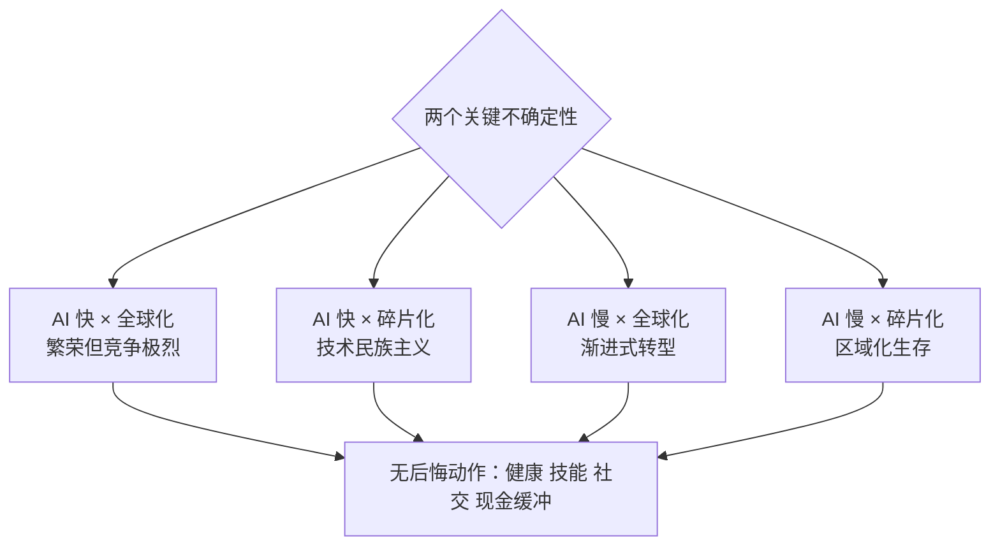

# 拓界篇 · 未来纪元：「前沿科学分布 × 国家与社会走向」

> **用途**：所有赛道都押注未来 —— 这里给你一张可核验的「世界地图更新包」：会做预测的方法 + 六大前沿科学雷达 + 宏观趋势 + 个人适配。
> 本页是 [第 11 阶 · 拓界](../stages/11-expand.md) 的五大赛道之一。

## 1. 先学会「怎么判断预测」（等级 A）

- **超级预测**：Tetlock 好判断项目——系统训练「分层校准 + 基础率 + 频繁小步更新」的人，准确率显著超越获密级情报的分析员。[C151]
- **情景规划**：不做单点预测；用「两个关键不确定性」搭四个情景，找**无后悔动作**。
- **预测市场**：实时聚合信息（如 [Polymarket](https://polymarket.com/)）——比观点便宜、比民调快，但注意流动性与操纵风险。
- **数据基线**：[Our World in Data](https://ourworldindata.org/) 是所有趋势判断的公共底稿。

## 2. 六大前沿科学雷达（2026 – 2045）

| 领域 | 为什么它改变一切 | 权威锚点 | 成熟度 |
|---|---|---|---|
| 人工智能 | 通用目的技术，渗透所有学科 | Stanford AI Index 年度报告 [C144] | 快速迭代（●●●●） |
| 生物技术（基因编辑 / 合成生物） | 生命被「可编程化」 | CRISPR 获 2020 诺贝尔化学奖 [C145] | 临床加速（●●●○） |
| 能源（聚变 / 光伏 + 储能） | 是一切成本的底 | NIF 首次实现聚变点火净能量增益 [C146] | 早期–成熟并存（●●○○） |
| 健康与长寿科技 | 老龄化社会刚需 | WHO 健康老龄化十年 [C150] | 转化期（●●●○） |
| 气候与地球系统工程 | 影响所有国家的约束条件 | IPCC AR6 综合报告 [C148] | 紧迫且确定（●●●●） |
| 空间与先进制造（观察位） | 成本曲线下探带来的新边疆 | 追踪 arXiv / 行业年报自行更新 | 早期（●○○○） |

## 3. 宏观趋势（数据均可核验）

- **人口**：UN《世界人口展望 2024》——全球人口在 2080 年代达到峰值约 103 亿后转降；老龄化加速（65+ 占比持续上升）。[C147]
- **气候**：IPCC AR6 综合报告——全球升温每增加 0.5°C，风险台阶式上升；减缓与适应必须双线进行。[C148]
- **治理与安全**：美国国家情报委员会《Global Trends 2040》——"竞争性共存（competitive coexistence）"，多重危机叠加的时代。[C149]
- **健康**：WHO——到 2050 年 60 岁以上人口将翻倍至 21 亿，「健康老龄化」成为国家战略。[C150]

## 4. 个人 / 组织适配（融入十阶）

| 动作 | 说明 | 对应十阶 |
|---|---|---|
| 主赛道 + 相邻期权 | T 型能力：一门深 + 两门前沿观察位 | ② 建图 · ⑦ 精练 |
| 无后悔动作清单 | 运动 / 睡眠 / 写作 / 社交 —— 任何情景都不亏 | ⑩ 维护 |
| 情景演练 | 2×2：AI 进展快慢 × 世界碎片化程度 → 四种情景下的职业选择 | ⑨ 教学（写出来才算想清） |
| 定期更新地图 | 每季度读一次 AI Index / OWID 数据页 | ⑥ 间隔 |

## 5. 检验清单

- [ ] 能说出三个「基础率」数字（人口峰值、老龄化、升温）；
- [ ] 为一个自己的判断写下 30% / 70% 概率与更新时间；
- [ ] 完成一次 2×2 情景演练并列出无后悔动作；
- [ ] 每季度更新一次本页雷达（有新证据就替换引用）。

## 参考（未来赛道）

- [C144] Stanford AI Index（年度报告）: <https://aiindex.stanford.edu/report/>
- [C145] Nobel Prize in Chemistry 2020（CRISPR）: <https://www.nobelprize.org/prizes/chemistry/2020/summary/>
- [C146] LLNL — Fusion Ignition（NIF）: <https://www.llnl.gov/news/national-ignition-facility-achieves-fusion-ignition>
- [C147] UN World Population Prospects: <https://population.un.org/wpp/>
- [C148] IPCC AR6 Synthesis Report: <https://www.ipcc.ch/report/ar6/syr/>
- [C149] NIC Global Trends 2040: <https://www.dni.gov/index.php/gt2040-home>
- [C150] WHO — Decade of Healthy Ageing: <https://www.who.int/initiatives/decade-of-healthy-ageing>
- [C151] Tetlock et al. — Identifying and Cultivating Superforecasters（EPJ）: <https://www.tandfonline.com/doi/full/10.1080/01973533.2015.1012991>
- [C152] Our World in Data（数据基线）: <https://ourworldindata.org/>
