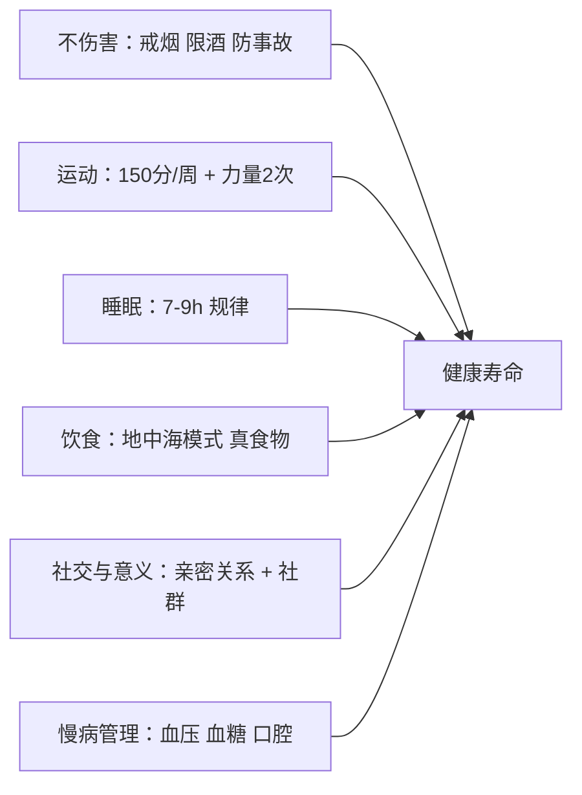

# 拓界篇 · 长寿赛道：「把身体当成基础设施」

> **何时进入**：任何时候都不晚 —— 健康寿命（healthspan）是科研 / 创业 / 人际所有赛道的**底座**。
> 本页是 [第 11 阶 · 拓界](../stages/11-expand.md) 的五大赛道之一。

## 1. 老化理论地图

- **衰老的十二大标志**（2023 扩展版）：基因组不稳定、端粒磨损、表观遗传改变、蛋白稳态丧失、营养感应失调、线粒体功能障碍、细胞衰老、干细胞耗竭、细胞间通讯改变、慢性炎症、菌群失调、大分子自噬受损。[C138]
- **进化视角**：身体是「可弃的 soma」（disposable soma）——自然选择不为老年优化，所以长寿**靠维护不靠进化本钱**。
- **诚实分级**：除少数干预（如雷帕霉素在小鼠）外，大多数「抗衰靶点」**尚无人体的硬终点证据**。把筹码押在下面表格中被反复验证的行为因素上。

## 2. 证据分级表（拿去做决策）

| 因素 | 关键证据 | 等级 |
|---|---|---|
| 不吸烟 | 20 世纪最大单项寿命增益 | A |
| 运动（150 分/周 + 力量 2 次） | 大样本队列汇总，全因死亡风险约 −30~40% [C139] | A |
| 睡眠 7–9 小时规律作息 | 74 万+ 人 meta：短睡死亡风险 +12% 量级 [C140] | A |
| 地中海饮食 | PREDIMED 随机对照：心血管事件显著下降 [C141] | A |
| 社交连接 | 148 研究 meta：存活率 +50% 量级 [C136] | A |
| 乐观与意义感 | 大型前瞻队列：高乐观组寿命更长 [C143] | B |
| 限时进食 / 间歇禁食 | 人体数据混合，收益主要来自总热量 | B |
| 「蓝区」极端长寿叙事 | 出生记录质量批评：超长寿集中于无出生证明地区 [C142] | C |
| 抗衰补剂（NAD+ 前体等） | 无人体硬终点证据 | C |
| 换血疗法 / 干细胞注射 | 无证据 + 真实风险 | D |

## 3. 长寿方程

## 4. 工具 / 数据

- **[wger](https://github.com/wger-project/wger)** ★7k — 开源训练与体重记录。
- **[Open Food Facts](https://github.com/openfoodfacts/openfoodfacts-server)** — 开放食物成分数据库。
- **[Our World in Data](https://ourworldindata.org/)** — 全球健康数据基线（免费可查）。

## 5. 检验清单（每年一次）

- [ ] 有三项硬指标最新数值：血压 / 血糖（或 HbA1c）/ 腰围；
- [ ] 周活动量 ≥150 分钟 + 2 次力量；
- [ ] 睡眠 7–9 小时达标 ≥5 天/周；
- [ ] 核心社交圈最近 30 天联系过；
- [ ] 复查用药与补剂清单（只留证据 A/B 的）。

## 参考（长寿赛道）

- [C138] López-Otín et al. (2023). Hallmarks of aging: An expanding universe（Cell）: https://pubmed.ncbi.nlm.nih.gov/36599349/
- [C139] Moore et al. (2012). Leisure-time physical activity and mortality（PLOS Med）: https://pubmed.ncbi.nlm.nih.gov/23139642/
- [C140] Cappuccio et al. (2010). Sleep duration and all-cause mortality（Sleep）: https://pubmed.ncbi.nlm.nih.gov/20469800/
- [C141] Estruch et al. (2013). PREDIMED（NEJM）: https://pubmed.ncbi.nlm.nih.gov/23432189/
- [C142] Newman. Supercentenarians and the oldest-old（bioRxiv）: <https://www.biorxiv.org/content/10.1101/704080v3>
- [C143] Lee et al. (2019). Optimism is associated with exceptional longevity（PNAS）: https://www.pnas.org/doi/10.1073/pnas.1816454116
