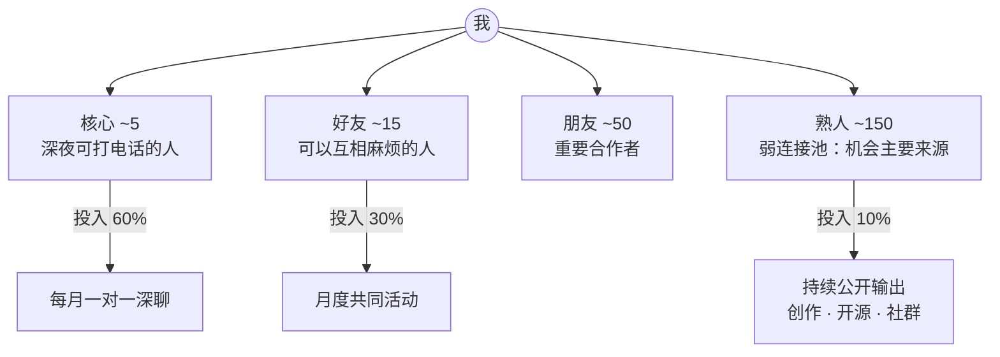

# 拓界篇 · 人际赛道：「关系是可建模的」

> **何时进入**：当瓶颈不再是知识而是「人」——合作、组建团队、亲密关系、家庭与社群。
> 本页是 [第 11 阶 · 拓界](../stages/11-expand.md) 的五大赛道之一。

## 1. 四种经典模型（人际关系模型类型）

1. **依恋类型（成人）**：安全型 / 焦虑型 / 回避型 / 紊乱型。成年人的亲密关系延续早期依恋模式 —— 类型是**维度上的倾向**，不是终身标签。[C130]
2. **爱情三角**：亲密 × 激情 × 承诺 → 七种形态（喜欢 / 迷恋 / 空爱 / 浪漫 / 伴侣 / 愚爱 / 完满）。[C131]
3. **连接强度**：强连接给**信任**，弱连接给**机会** —— 求职与创新信息多数来自弱连接（经典「弱连接的强度」）。[C132]
4. **互惠结构**：直接互惠 → 间接互惠（声誉）→ 网络互惠；长期博弈中「先友善、被惹才惩罚、随后宽容」是最优策略族（以牙还牙的进化博弈）。[C133]

**圈层模型（邓巴层级）**：亲密 ≈5 / 好友 ≈15 / 朋友 ≈50 / 熟人 ≈150；数量层级与投入深度成反比（确切数字有争议，取「分层经营」的启发）。[C134]

## 2. 判断与经营方法（等级 A/B）

- **冲突可预测**：「末日四骑士」（批评 / 鄙视 / 辩护 / 冷战）的频繁出现强烈预测关系解体；**修复尝试**（repair attempts）是决定性变量。[C135]
- **社会支持是健康因子**：148 项研究汇总——社会关系强的人存活率高约 50%，效应与戒烟同级。[C136]
- **非暴力沟通四步**：观察 → 感受 → 需要 → 请求，把冲突从「评价」拉回「需求」。[C137]

## 3. 关系地图

## 4. 操作清单

- 每周：1 次主动连接（发一条「想到你」的信息）；
- 每月：核心圈 5 人各一次一对一；
- 每季：盘点弱连接池（新认识 10 人 / 回访 10 人）；
- 冲突场景：先做修复尝试，再谈分歧（禁四骑士）。

## 5. 检验清单

- [ ] 能画出自己的 5 / 15 / 50 / 150 名单；
- [ ] 过去 30 天完成 ≥4 次一对一；
- [ ] 冲突记录：本轮是否出现四骑士？是否有修复尝试？
- [ ] 弱连接带来过至少一个真实机会（信息、合作或客户）。

## 6. 深潜一：交换、共有与公平

- **社会交换理论**：人际互动可视为「报酬 − 成本 − 期望」的交换；关系满意度与替代方案（comparison level for alternatives）共同决定去留。[C161]
- **交换型 vs 共有型关系**：交换型（记账、即时对等）适合交易与合作；共有型（按需响应、不记账）适合亲密与高强度团队——**用错模式是冲突之源**：对朋友记账、对同事索求无度都违背了各自的关系规则。[C162]

## 7. 深潜二：社会资本与「桥」

- **黏合资本 vs 桥接资本**：黏合连接同质者、提供支持；桥接连接异质者、提供**机会**——职业跃迁多由桥接资本驱动。[C163]
- **结构洞**：站在两个互不相连群体「洞」上的人拥有信息套利与创意优势——好点子更多来自跨群体中介。行动：刻意成为两圈之间「唯一互相认识的人」。[C164]

## 8. 深潜三：信任方程与心理安全

- **信任三要素**：能力 × 善意 × 正直——三项都可疑时信任崩塌；修复顺序上「正直」最难重建，所以承诺要少而准。[C165]
- **团队心理安全**：成员确信「说出错误不会受罚」时，团队学习行为与绩效显著更好（医院团队经典研究）。行动：领导者先示范公开认错。[C166]

## 9. 深潜四：说服与冲突模式

- **说服六原则**（正当使用）：互惠、承诺一致、社会认同、喜好、权威、稀缺——先给价值，再谈请求。[C167]
- **冲突五模式（TKI）**：竞争 / 协作 / 妥协 / 回避 / 迁就——按「议题重要性 × 关系重要性」选模式；长期关系中默认协作。[C168]
- **依恋四象限**：自我模型 × 他人模型 → 安全 / 焦虑 / 回避 / 恐惧型；沟通配方不同：对焦虑型给确定性，对回避型给空间，对恐惧型给稳定的一致信号。[C169]

## 参考（人际赛道）

- [C130] Hazan & Shaver (1987). Romantic love conceptualized as an attachment process: <https://psycnet.apa.org/doiLanding?doi=10.1037%2F0022-3514.52.3.511>
- [C131] Sternberg (1986). A triangular theory of love: <https://psycnet.apa.org/doiLanding?doi=10.1037%2F0033-295X.93.2.119>
- [C132] Granovetter (1973). The Strength of Weak Ties（PDF）: <https://snap.stanford.edu/class/cs224w-readings/granovetter73weakties.pdf>
- [C133] Nowak & Sigmund (2005). Evolution of indirect reciprocity（Nature）: <https://www.nature.com/articles/nature04131>
- [C134] Dunbar's numbers（Biology Letters 2021）: https://pubmed.ncbi.nlm.nih.gov/33947220/
- [C135] The Gottman Institute — 关系研究总览: <https://www.gottman.com/about/research/>
- [C136] Holt-Lunstad et al. (2010). Social Relationships and Mortality Risk（PLOS Med）: <https://journals.plos.org/plosmedicine/article?id=10.1371/journal.pmed.1000316>
- [C137] 非暴力沟通中心（CNVC）: <https://www.cnvc.org/>
- [C161] Homans (1958). Social Behavior as Exchange (AJS): <https://doi.org/10.1086/222355>
- [C162] Clark & Mills (1979). Interpersonal attraction in exchange and communal relationships: <https://psycnet.apa.org/doiLanding?doi=10.1037%2F0022-3514.37.1.12>
- [C163] Putnam (1995). Bowling Alone: America's Declining Social Capital: <https://www.journalofdemocracy.org/articles/bowling-alone-americas-declining-social-capital/>
- [C164] Burt (2004). Structural Holes and Good Ideas (AJS): <https://doi.org/10.1086/421787>
- [C165] Mayer, Davis & Schoorman (1995). An Integrative Model of Organizational Trust (AMR): <https://doi.org/10.5465/amr.1995.9508080335>
- [C166] Edmondson (1999). Psychological Safety and Learning Behavior in Work Teams (ASQ): <https://journals.sagepub.com/doi/10.2307/2666999>
- [C167] Cialdini (2001). Harnessing the Science of Persuasion: <https://hbr.org/2001/10/harnessing-the-science-of-persuasion>
- [C168] 冲突五模式（TKI 方法论）: https://www.themyersbriggs.com/en-US/Products-and-Services/TKI
- [C169] Bartholomew & Horowitz (1991). Attachment styles among young adults: <https://psycnet.apa.org/doiLanding?doi=10.1037%2F0022-3514.61.2.226>

