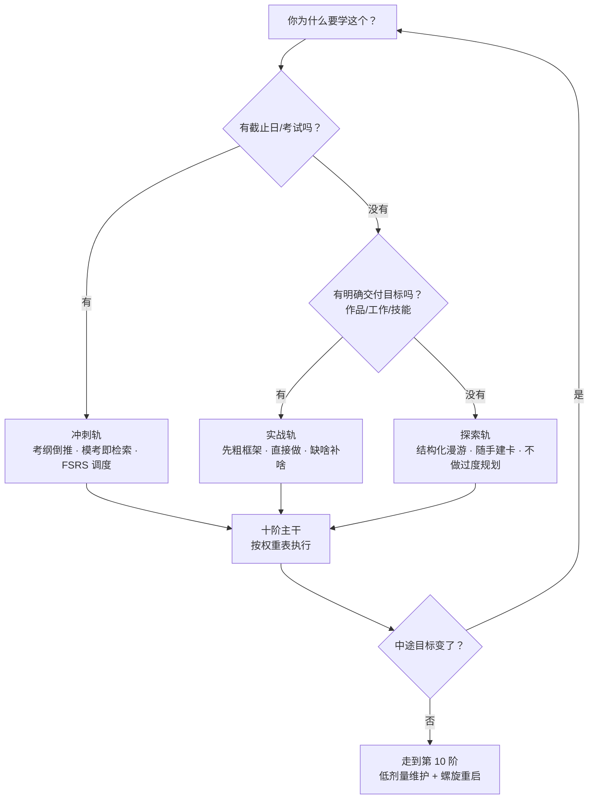

# 路线与领域适配 · Paths & Domains

> 同一套十阶，不同走法。**先选路线，再选领域重心，然后只做该做的事。**
> 本文给的是「权重与节奏」建议（经验值），方法与证据见 `docs/stages/` 与 `docs/evidence.md`。

## 0. 先回答三个问题

## 1. 三条路线详解

### 1.1 探索轨（无明确目标，想了解一个领域）

- **适用判据**：好奇、想建立全局认识、暂不需要产出。
- **阶段权重**：

| 阶 | 1 立志 | 2 建图 | 3 拆解 | 4 编码 | 5 检索 | 6 间隔 | 7 精练 | 8 实战 | 9 教学 | 10 维护 |
|----|----|----|----|----|----|----|----|----|----|----|
| 权重 | 轻 | **重** | **重** | **重** | **重** | 中 | 轻 | 轻 | 中 | 轻 |

- **首月行动单**：
  1. 用「发展史 / 横向对比 / 顶点倒推」三条进路各画一版领域草图（30 分钟粒度即可）；
  2. 标出 3 个门槛概念（[C42]），只学它们附近的材料；
  3. 每学一块，写 1 张「最简解释」+ 3 张卡片，入库 Anki；
  4. 月底做一次 20 分钟空白纸回忆，检验地图能不能独立画出来。
- **陷阱**：变成收藏家；地图越画越大、卡越做越多但从不检索。

### 1.2 实战轨（有交付目标：作品 / 工作 / 技能）

- **适用判据**：有明确的「要做出什么」「什么时候要」，例如上线一个工具、跑通一次演讲、接手一个岗位技能。
- **阶段权重**：

| 阶 | 1 | 2 | 3 | 4 | 5 | 6 | 7 | 8 | 9 | 10 |
|----|---|---|---|---|---|---|---|---|---|----|
| 权重 | **重** | 轻（粗框架即可） | **重** | 中 | 中 | 中 | **重** | **重** | 中 | 轻 |

- **首月行动单**：
  1. 写一页学习契约（目标 = 可交付物 + 验收人）；
  2. 画一张「粗框架」：只到能提出问题为止（对应参考方法的「干中学」环：做→碰到问题→有目的查学→小结回填）；
  3. 直接开工，建立错题日志；
  4. 每两周一次「复盘 + 补图」：把做中学到的散点补进知识地图。
- **陷阱**：教程地狱（一直准备不动手）；不做粗框架直接乱撞；只做不记，错误反复犯。
- **与引导式教学的平衡**：新手阶段先用示范与小项目练手（[C15][C16]），再进入真实大项目。

### 1.3 冲刺轨（考试 / 证书 / 硬截止）

- **适用判据**：有明确考试日期或截止日，成果可被标准化检验。
- **阶段权重**：

| 阶 | 1 | 2 | 3 | 4 | 5 | 6 | 7 | 8 | 9 | 10 |
|----|---|---|---|---|---|---|---|---|---|----|
| 权重 | **重**（倒排期） | 中（考纲即地图） | 中 | 中 | **重** | **重** | **重** | 中（模考） | 轻 | 轻 |

- **首月行动单**：
  1. 把考纲/样题拆成原子清单，标注「会 / 半会 / 不会」；
  2. 先做一套模考当预测试（错也赚，[C05]）；
  3. 卡片 + FSRS 调度上线（[C26][C27]），目标留存率先设 0.9；
  4. 每周一次限时模考，错题进日志，根因分类后再练。
- **陷阱**：只刷题不建图（变形题就懵）；把「刷完一遍」当目标而不是「延迟正确率」。

### 1.4 换乘规则

- 探索轨 → 实战轨：出现具体目标时，把地图收窄到目标相关分支，进入「做→缺→补」环；
- 实战轨 → 探索轨：项目结束、想系统化时，回头补齐阶段 2–4 的地图与笔记；
- 冲刺轨 → 任意：考试结束后立刻降级为探索/实战轨的低剂量维护，防止技能衰减（[C28]）。

## 2. 五大领域适配

| 领域 | 重心阶段 | 招牌方法 | 关键工具 | 过关标准 | 常见坑 |
|------|----------|----------|----------|----------|--------|
| [语言](domains/language.md) | 4·5·6·7·8 | 可理解输入 + 挖句建卡 + 间隔重复 + 输出实战（[C69][C04][C06]） | Yomitan、asbplayer、Anki+FSRS、Whisper | 真实对话 30 分钟不崩；延迟测词汇保持 ≥80% | 只背单词书；不输出；字幕依赖 |
| [编程与工程](domains/programming.md) | 3·7·8·5 | 项目驱动 + 小步练习带反馈 + 代码评审 + 检索式复习 | Exercism、freeCodeCamp、Odin、GitHub | 能独立交付一个可运行作品；bug 根因分类闭环 | 教程地狱；复制粘贴过测试 |
| [数学与理论](domains/math.md) | 3·4·5·7 | 示范题→变式→独立解（[C15]）+ 先挫后教（[C09]）+ 证明/形式化即时反馈 | Lean 4、Mathematics in Lean、Notion/纸质推导 | 延迟 1 周仍能独立复推主定理；能给反例 | 只看不推；跳过前提 |
| [乐器与运动](domains/skills.md) | 7·6·8 | 慢练与分解 + 变化练习（[C30]）+ 教练反馈（[C46]）+ 表演实战 | Audacity、MuseScore、录音回看 | 冷启动一次完整演奏/动作标准达成 | 只练已会片段；无反馈苦练（[C47]） |
| [考试与证书](domains/exam.md) | 1·5·6·7 | 考纲倒推 + 模考即检索 + FSRS + 错题根因 | Anki、模考卷、错题日志模板 | 连续两次限时模考达标；延迟正确率稳定 | 假刷题（对答案式做题） |

## 3. 30 天启动模板（通用）

| 周 | 主题 | 动作 | 产出 |
|----|------|------|------|
| W1 | 立志 + 建图 | 契约 + 三条进路草图 + 选 3 个门槛概念 | 一页契约；一页地图 |
| W2 | 拆解 + 编码 | 原子清单 + 每原子 1 个练习动作；做第一批卡片 | 原子清单；30–50 张卡 |
| W3 | 检索 + 间隔 | 日常检索（空白纸/自测）；FSRS 上线；第一次交错测验 | 留存数据；错题日志 |
| W4 | 精练 + 实战（首战） | 攻一个最弱子技能；完成一个最小真实交付 | 交付物 v0；两周复盘 |

## 4. 每日 / 每周节律样板

- **极简版（≈25 分钟/天）**：10 分钟复习队列 → 12 分钟新内容（学完立刻检索一遍）→ 3 分钟记录（错题/疑问）。
- **标准版（60–90 分钟/天）**：20 分钟复习 → 40 分钟主攻（按当前阶段权重）→ 10 分钟检索输出（空白纸/讲给自己）→ 5–10 分钟日志。
- **冲刺版（2–3 小时/天）**：复习 → 2 个深度块（各 45 分钟，块间 10 分钟休息）→ 1 次限时练习/模考 → 错题处理。
- **每周固定动作**：周检视（`templates/weekly-review.md`）+ 一次累计交错测验。

## 5. 复习预算速查（防「复习量爆炸」）

- 起步：新卡上限设小（如 20–30 张/天），先把复习队列清干净；
- 规则：**复习优先于新卡**；宁可少而准，不追求清空所有新卡；
- 目标留存率：从 0.9 起步，用 FSRS 优化器按个人日志调整（[C26][C27]）；
- 难缠卡片（leech）：暂停并改写卡片（拆小/加图/换问法）——多半是卡片问题，不是你的问题；
- 积压处理：暂停新卡 → 按逾期程度分批清算 → 恢复日常；
- 判断标准：连续一周「当日复习完成率 ≥90% 且次日留存达标」，再加量。

---

**导航**：[📚 文档总目录](README.md) ｜ [🏠 项目主页](../README.md) ｜ [在线主页](https://HuanMoovo.github.io/fuxi/)
