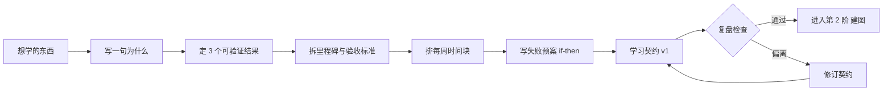

# 第 1 阶 · 立志（Orient） 启程纪 · 把「想学」变成可执行契约

> 建议占时：1–3%（经验值）｜ 证据总评：B–C（中—条件）｜ 上一阶：— ｜ [下一阶 →](./02-map.md)

## 阶段目标

本阶回答：**为什么学？学到什么算赢？** 交付一页《学习契约》，把模糊愿望转成可执行承诺。

- 一页《学习契约》：3 个可被他人检验的结果（作品 / 测试通过 / 可演示成果）。
- 每个结果拆成里程碑，标注「到什么程度算过」与大致时间点。
- 每周固定学习时间块：周几、什么时段、多长，写进日历。
- 失败预案：状态差、加班、中断三类场景各自的最低保底动作（if-then 形式）。

## 为什么放在这里（认知机制）

学习的第一损耗往往不在智力，而在方向与持续。目标设定理论表明：具体、有挑战且配反馈的目标，才稳定提升表现；模糊愿望无法定向注意力（[C36]）。自我调节学习循环要求先完成「任务分析、目标设定、动机信念」的前瞻阶段，再进入执行与自省；跳过它，后面每阶都要重复付学费（[C37]）。执行意图（implementation intention）研究给出了把意向变成行动的机制：预先写好 if-then 触发规则，目标达成率更高（[C33]）。动机能否内化，取决于自主、胜任、联结三种心理需求是否被照顾（[C34]）。本阶只占总时间的 1–3%，却决定其余九阶的摩擦系数。

## 核心方法（方法卡）

> 等级为本项目对现有证据的综合判断，非期刊官方评级。

### 学习契约（Learning Contract）

- **机制**：把「结果 → 行为 → 里程碑」的目标层级写下来，让注意力、反馈与验收都有锚点，而不依赖每天的心情。
- **怎么做**：
  1. 写一句「为什么」：不是「想提升自己」，而是「要用它做成什么、给谁看」；
  2. 定 3 个结果：每个结果可被第三方检验（提交物 / 通过某项测试 / 完成一个作品）；
  3. 把每个结果拆成阶段性里程碑，标注「到什么程度算过」与大致时间点；
  4. 写每周时间块：固定「周几 + 时段 + 时长」，写进日历；
  5. 写保底预案：状态差时做的最小动作（例如复习旧卡）。
- **最合适**：任何正式学习项目启动时。**不适用**：纯休闲探索——但至少写下一句话的「为什么」。
- **证据**：B —— [C36](https://psycnet.apa.org/doiLanding?doi=10.1037%2F0003-066X.57.9.705)（目标设定理论）、[C37](https://www.leiderschapsdomeinen.nl/wp-content/uploads/2016/12/Zimmerman-B.-2002-Becoming-Self-Regulated-Learner.pdf)（自我调节学习循环）。

### WOOP 与执行意图（Mental Contrasting + Implementation Intentions）

- **机制**：心理对照把愿望与现实障碍同时放进视野；if-then 计划把行动触发预先绑定到具体情境，降低启动成本（[C33]）。
- **怎么做**：
  1. 按四步走：愿望（Wish）→ 结果（Outcome）→ 障碍（Obstacle）→ 计划（Plan）；
  2. 障碍写成具体场景（「晚上九点开始刷短视频」），不写「没毅力」这类人格判断；
  3. 每个障碍配一条 if-then：「如果 X 发生，我就做 Y」；Y 必须小到能立即执行；
  4. 把 if-then 卡贴在学习位置，或设成手机提醒。
- **最合适**：目标已明确、但执行不稳定的阶段。**不适用**：目标还在摇摆时——先用学习契约把目标定下来。
- **证据**：A/B —— [C33](https://www.researchgate.net/publication/37367696_Implementation_Intentions_and_Goal_Achievement_A_Meta-Analysis_of_Effects_and_Processes)（对目标达成有稳健中等效应）。

### 时间预算与范围控制（Time Budget & Scope Control）

- **机制**：时间是硬约束。先分配、再承诺，避免「全都要」导致每样都浅尝即止。
- **怎么做**：
  1. 先写「不学什么」：列出明确放弃或缓学的范围（80/20 取样）；
  2. 把每周真实可支配时间写实（扣除通勤、体力、家庭），宁可低估；
  3. 给每阶设时间上限：超时就砍范围，不轻易加时；
  4. 按「约 2 个月、个体差异极大」设置习惯预期，别按天数给自己排刑期（[C38]）。
- **最合适**：工作与学业并行、时间碎片化的人。**不适用**：短期全脱产冲刺——此时边界由截止日决定。
- **证据**：C —— 经验方法；习惯时间尺度参考 [C38]（Lally et al., 2010, EJSP，无链接）。

### 自我效能四来源（Sources of Self-Efficacy）

- **机制**：效能信念决定是否愿意投入、受挫后能否坚持；四个来源中，亲历成功经验影响最大（[C35]）。
- **怎么做**：
  1. 设计小胜：把第一周任务切到「稍微用力就能完成」的难度；
  2. 找可模仿的榜样：选水平略高于你、路径可复制的人，而非天才叙事；
  3. 让同伴互相复述进步（言语说服的合理形式），少自我贬低；
  4. 记录睡眠、体力与状态的关系（生理与情绪状态也是来源之一）。
- **最合适**：启动期、受挫后重建信心。**不适用**：不能替代真实能力建设——效能感要压在真实证据上。
- **证据**：B —— [C35]（Bandura 1977，自我效能四来源，文本引，无链接）。

### 动机内化（Autonomy · Competence · Relatedness）

- **机制**：自我决定理论（self-determination theory）指出，自主、胜任、联结三种基本心理需求满足度越高，动机越可能内化，行为越持久（[C34]）。
- **怎么做**：
  1. 保留选择感：在方法、材料、节奏上给自己留出自主空间；
  2. 设计胜任阶梯：任务难度贴着当前能力的边缘走；
  3. 建立联结：加入一个能对话的社区，或找一位学习搭子；
  4. 连接效用价值：写下「它与我生活、工作的具体关系」（[C39]，文本引）。
- **最合适**：长期项目、容易中段熄火的领域。**不适用**：应急考试周——先活下来，内化问题放到考后。
- **证据**：B —— [C34](https://selfdeterminationtheory.org/SDT/documents/2000_RyanDeci_SDT.pdf)（自我决定理论）、[C39]（效用价值，文本引）。

## 工具（开源优先）

| 工具 | 链接 | 用途 | 备注 |
|------|------|------|------|
| Super Productivity | https://github.com/johannesjo/super-productivity | 任务与时间块执行 | 桌面 / 移动端 |
| Loop Habit Tracker | https://github.com/iSoron/uhabits | 固定时段学习打卡 | Android |
| ActivityWatch | https://github.com/ActivityWatch/activitywatch | 自动追踪时间去向 | 跨平台 |
| Habitica | https://github.com/HabitRPG/habitica | 把习惯执行游戏化 | Web / 移动端 |

配套模板：`templates/learning-contract.md`（《学习契约》填空版，按方法卡一的结构填写）。

## 过关自测
- 能一句话说清「为什么学」，且句中有一个具体对象（谁、用来做什么）。
- 3 个结果都能被别人检验：拿给朋友看，他能判断「达成 / 未达成」。
- 有「每周什么时候学」的具体时段，并已在日历中占位。
- 写下「状态差时怎么保底」，且保底动作小到状态差时也做得动。
- 能把《学习契约》讲给朋友听，对方能复述出 3 个结果。

## 常见误区
- 靠意志力裸奔：只喊「我要自律」，不写 if-then、不做环境设计；机制在预绑定，不在决心（[C33]）。
- 目标 = 「学好英语」：不可检验、无验收标准、无截止时间（[C36]：目标要具体且有挑战）。
- 不做时间预算：把「有空就学」当计划，实际投入总是低于预期——先分配，再承诺。
- 只收藏方法论不开始：收集带来「已经在学」的错觉（[C37]：前瞻之后必须进入执行与自省循环）。

## AI 副驾（此阶段）
- 用法：让 AI 扮演教练，追问目标与失败预案：「这个结果三天后谁能检验？」「最可能失败的是哪个场景？」；也可让它给「典型里程碑样例」供你裁剪（明确它是参考而非标准）。
- 协议（**先自己再AI**）：先独立写完「为什么 / 3 个结果 / 保底预案」草稿，再交给 AI 只做追问与挑错；不直接索取「标准答案」；撤掉 AI 后必须能独立复述并执行这份契约。
- 风险证据：把 AI 当答案机会诱发依赖与「元认知懒惰」（[C57](https://bera-journals.onlinelibrary.wiley.com/doi/10.1111/bjet.13544)）；校内实验显示，无护栏的 AI 辅助在撤除后独立考试表现更差，带「只提示、不给答案」护栏的版本可缓解（[C56](https://www.pnas.org/doi/10.1073/pnas.2422633122)）。

## 参考
- [C33] Gollwitzer & Sheeran (2006)：执行意图元分析，对目标达成有稳健中等效应。https://www.researchgate.net/publication/37367696_Implementation_Intentions_and_Goal_Achievement_A_Meta-Analysis_of_Effects_and_Processes
- [C34] Ryan & Deci (2000)：自我决定理论（自主 / 胜任 / 联结）。https://selfdeterminationtheory.org/SDT/documents/2000_RyanDeci_SDT.pdf
- [C35] （文本引）Bandura (1977)：自我效能四来源。
- [C36] Locke & Latham (2002)：目标设定理论 35 年。https://psycnet.apa.org/doiLanding?doi=10.1037%2F0003-066X.57.9.705
- [C37] Zimmerman (2002)：自我调节学习循环。https://www.leiderschapsdomeinen.nl/wp-content/uploads/2016/12/Zimmerman-B.-2002-Becoming-Self-Regulated-Learner.pdf
- [C38] Lally et al. (2010, EJSP)：习惯自动化中位数 66 天（18–254 天区间）。
- [C39] （文本引）Hulleman & Harackiewicz (2009)：效用价值干预。
- [C56] Bastani et al. (2025, PNAS)：撤除无护栏 AI 后独立考试表现更差。https://www.pnas.org/doi/10.1073/pnas.2422633122
- [C57] Fan et al. (2025, BJET)：生成式 AI 的依赖与「元认知懒惰」风险。https://bera-journals.onlinelibrary.wiley.com/doi/10.1111/bjet.13544

上一阶：— ｜ [下一阶 →](./02-map.md)
