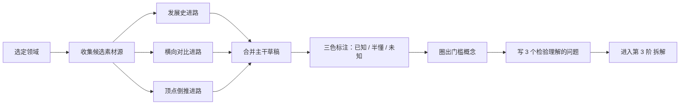

# 第 2 阶 · 建图（Map） 启程纪 · 先见森林，画出领域地图

> 建议占时：5–10%（经验值）｜ 证据总评：B–C（中—条件）｜ [上一阶 ←](./01-orient.md) ｜ [下一阶 →](./03-decompose.md)

## 阶段目标

本阶回答：**这个领域由什么构成？** 交付一页领域地图、一组检验问题与候选素材源清单——先见森林，后见树木。

- 一页领域地图：知识树或概念图，主干清晰，能 60 秒讲清。
- 3 个能检验理解的问题：答得出来，说明地图没有大洞。
- 候选素材源清单：教科书、课程、路线图等多类来源，可持续供给。
- 状态标注：在地图上标出「已知 / 半懂 / 未知」，并圈出门槛概念候选。

## 为什么放在这里（认知机制）

新手进入新领域，最大的损耗是「没有挂点」：零散术语无处安放，学了就忘，也说不清自己处在何处。先行组织者（advance organizer）研究（[C41] 文本引 Ausubel, 1960；Novak 概念图）表明：先给出上位结构、再接触细节，后续学习的组织度与保持更好——结构的作用是给新知识当挂钩。从认知负荷看，工作记忆容量有限（[C17] 文本引），地图把海量细节暂时压成骨架，让有限带宽先处理结构；对新手，有结构引导的学习也优于自由摸索（[C16]）。门槛概念（threshold concepts）研究（[C42]）进一步提示：领域内存在少数「卡住则一片全卡」的转折点，建图阶段就该识别它们、预留资源。本阶不产出能力，只产出结构——但后面每阶的输入都靠它定位。

## 核心方法（方法卡）

> 等级为本项目对现有证据的综合判断，非期刊官方评级。

### 知识树三进路（Three Routes to a Knowledge Tree）

- **机制**：同一领域可从时间轴（发展史）、结构面（横向对比）、目标点（顶点倒推）三个方向切出骨架；先并行各画一稿，再合并成一条主干。
- **怎么做**：
  1. 发展史：把领域写成「问题 → 解法 → 新问题」的时间线，范式转变处就是主干关节；
  2. 横向对比：选几本同类教材、工具或流派列差异表，差异维度往往就是地图的分类轴；
  3. 顶点倒推：从一个具体目标（要做的作品、要解的问题）反向列「需要什么」，得到最短路径骨架；
  4. 三条路各出一稿草稿，选信息量最大的一条当主干，其余压缩成旁注。
- **最合适**：体系庞杂、入门材料杂乱的领域。**不适用**：边界清晰的窄技能（如某个软件操作）——直接列清单即可。
- **证据**：C —— 经验方法（来源：参考方法论与结构化思维实践，无对照实验）；「结构先行」的底层有 [C41]（文本引）支持。

### 概念图与先行组织者（Concept Maps & Advance Organizers）

- **机制**：用「上位概念 — 连接词 — 下位概念」的网把新信息挂到旧知识上；先行组织者验证了「先结构、后细节」的顺序价值（[C41]）。
- **怎么做**：
  1. 先把上位核心概念列出来（一屏之内），再连线，每条边写连接词（「包含」「导致」「对比于」）；
  2. 做连通性检查：从任一概念出发，能否沿连线走到其他主干概念；
  3. 第一版求快、宁糙勿美；地图是迭代品，不是作品；
  4. 记住边界：概念图的长处在组织知识；要检验掌握，主动检索优于纯画图（[C71](<https://doi.org/10.1126/science.1199327>)）。
- **最合适**：概念密集、关系复杂的学科。**不适用**：以程序与手感为主的技能——改用流程图或依赖图。
- **证据**：B —— [C41]（Ausubel 1960 先行组织者；Novak 概念图，文本引）；边界条件见 [C71](https://doi.org/10.1126/science.1199327)。

### 门槛概念（Threshold Concepts）

- **机制**：领域内少数关键转折点「跨过去才能看见新世界」，卡住一个会连带堵住一片；提前识别是低成本保险（[C42]）。
- **怎么做**：
  1. 问前辈、老师或社区：哪个概念卡住过最多人？
  2. 在教材里搜寻两个信号：「反复出现的警告」与「先修要求」；
  3. 标记候选门槛概念，并写下「卡住时的表现」（说不清、用不对、一用就错）；
  4. 为每个候选预留加时：不在本阶硬啃，但在后续各阶优先分配资源。
- **最合适**：理论累积型学科。**不适用**：概念体系仍在争议中的新兴领域——先记录，不武断下结论。
- **证据**：C —— [C42](<https://www.research.ed.ac.uk/en/publications/threshold-concepts-and-troublesome-knowledge-linkages-to-ways-of-/>)（概念有实证基础；个体学习层面的操作方法证据有限）。

### 素材源（Source Gathering）

- **机制**：素材是后续各阶的输入燃料。开工前固定「可持续供给」的源清单，避免中途断粮或反复换教材。
- **怎么做**：
  1. 教科书目录：找几本取向不同的教材，目录差异本身就是地图信息；
  2. roadmap.sh、OSSU：成熟路线图直接当骨架候选，再按你的目标裁剪；
  3. 课程大纲：公开课大纲自带结构与先修顺序；
  4. Learn Anything 一类领域索引可当线索入口，注意质量参差；
  5. 让 AI 起草候选清单后，逐条对照真实源核验（幻觉高发区，风险见 [C57]）。
- **最合适**：完全陌生的领域。**不适用**：已有可靠师承或现成课程——直接以它为主干。
- **证据**：C —— 经验方法。

### 地图粒度控制（Granularity Control）

- **机制**：地图是索引，不是仓库。粒度越细，维护成本越高、迭代越慢；先控成本，才能持续迭代。
- **怎么做**：
  1. 设停止规则：支线展开到「下一步能变成可学单元」就停，不再下钻；
  2. 主干只保留粗骨架，更深的内容留给第 3 阶拆解；
  3. 用「60 秒能否讲清主干」当验收标准；
  4. 每次学习后花一点时间更新地图，而不是追求一次完美。
- **最合适**：所有领域的首次建图。**不适用**：临时应急只需一条任务路径时——用顶点倒推画单线即可。
- **证据**：C —— 经验方法。

## 工具（开源优先）

| 工具 | 链接 | 用途 | 备注 |
|------|------|------|------|
| markmap | https://github.com/markmap/markmap | 用 Markdown 大纲生成思维导图 | 可从笔记直接渲染 |
| Excalidraw | https://github.com/excalidraw/excalidraw | 手绘风概念图与草图 | 轻量、快速开画 |
| draw.io | https://github.com/jgraph/drawio | 流程图与结构图 | 跨平台 |
| Mermaid | https://github.com/mermaid-js/mermaid | 文本描述图，便于版本管理 | 可嵌入 Markdown |
| Obsidian | https://github.com/obsidianmd/obsidian-releases | 地图与笔记同处一库 | 桌面 / 移动端 |
| roadmap.sh | https://github.com/kamranahmedse/developer-roadmap | 领域路线图骨架参考 | 尤适 IT 领域 |
| OSSU | https://github.com/ossu/computer-science | 计算机科学课程路线 | 大纲式参考 |

## 过关自测
- 能画出领域地图，并在 60 秒内讲清主干。
- 指出 3 个门槛概念，并各自写出「卡住时的表现」。
- 地图上有「已知 / 半懂 / 未知」三色标注。
- 素材源清单覆盖两类以上来源（教材 / 课程 / 路线图），能支撑第一个学习主题。
- 粒度检查：任一展开支线都能变成下一步的可学单元，而不是继续嵌套。

## 常见误区
- 把收藏当学习：收藏了一堆链接，地图仍是空白——收藏不产生结构，画出来才算。
- 追求图的美观而非结构：配色、排版花很久，连通性却没检查；概念图的价值在连接与层级（[C41]）。
- 一次画到完美：地图不迭代就是死地图；给它设过期时间，每学一段更新一次。
- 让 AI 代画、自己不组织：没经过亲手组织的结构挂不住知识（护栏见「AI 副驾」）。

## AI 副驾（此阶段）
- 用法：先独立画出主干草稿，再让 AI 指出「缺口与重复」；也可让它先给「候选树」，但你逐条核验后再并入。
- 协议（**先自己再AI**）：草稿与判断先行，AI 只做追问与挑错；让 AI 生成候选树时必须标明「可能有幻觉」；撤掉 AI 后必须能独立讲清主干。
- 风险证据：生成式 AI 会诱发依赖与「元认知懒惰」（[C57](<https://bera-journals.onlinelibrary.wiley.com/doi/10.1111/bjet.13544>)）；实验显示无护栏的 AI 辅助在撤除后独立表现更差（[C56](<https://www.pnas.org/doi/10.1073/pnas.2422633122>)）。

## 参考
- [C16] Kirschner, Sweller & Clark (2006)：对新手而言「最小指导」无效，有结构引导的学习更优。https://www.tandfonline.com/doi/abs/10.1207/s15326985ep4102_1
- [C17] （文本引）Chase & Simon (1973)、Cowan (2001)：工作记忆限制与组块。 <https://doi.org/10.1016/0010-0285(73)90004-2>；<https://pubmed.ncbi.nlm.nih.gov/11515286>
- [C41] （文本引）Ausubel (1960) 先行组织者；Novak 概念图。 <https://doi.org/10.1037/h0043805>；<https://cmap.ihmc.us/publications/researchpapers/theoryunderlyingconceptmaps.pdf>
- [C42] Meyer & Land (2003)：门槛概念。https://www.research.ed.ac.uk/en/publications/threshold-concepts-and-troublesome-knowledge-linkages-to-ways-of-/
- [C56] Bastani et al. (2025, PNAS)：撤除无护栏 AI 后独立表现更差。https://www.pnas.org/doi/10.1073/pnas.2422633122
- [C57] Fan et al. (2025, BJET)：生成式 AI 的依赖与「元认知懒惰」风险。https://bera-journals.onlinelibrary.wiley.com/doi/10.1111/bjet.13544
- [C71] Karpicke & Blunt (2011)：检索练习优于概念图复习（迁移测验）。https://doi.org/10.1126/science.1199327

### 扩展阅读（v1.1 新增）
- [C102] Novak & Cañas：概念图的理论基础（PDF）。 <https://cmap.ihmc.us/publications/researchpapers/theoryunderlyingconceptmaps.pdf>
- [C97] 美国国家科学院 (2018) How People Learn II（免费全书）。 <https://nap.nationalacademies.org/catalog/24783/how-people-learn-ii-learners-contexts-and-cultures>

[上一阶 ←](./01-orient.md) ｜ [下一阶 →](./03-decompose.md)
