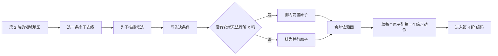

# 第 3 阶 · 拆解（Decompose） 建构纪 · 拆到能一口吃下的原子

> 建议占时：5–10%（经验值）｜ 证据总评：A–C（强—条件）｜ [上一阶 ←](./02-map.md) ｜ [下一阶 →](./04-encode.md)

## 阶段目标

本阶回答：**最小可学单元是什么？** 把地图主干拆成原子清单，排好依赖顺序，并给每个原子配第一个练习动作。

- 原子清单：每个原子 = 一次能练、能考的最小单元（15–30 分钟可完成一个练习动作）。
- 依赖顺序：能回答「学这个之前需要什么」，并画出依赖图。
- 练习动作：每个原子配一个「今天就能做」的动作，而不是「看一遍资料」。
- 对齐门槛概念：第 2 阶圈出的门槛概念在清单中有位置、有预留时间。

## 为什么放在这里（认知机制）

专家与新手的分水岭之一是「组块」（chunking）：专家把领域信息压成有意义的块（[C24] 文本引 Chase & Simon, 1973），新手则受限于工作记忆（[C17] 文本引），一次只能握住少量元素。拆解的目的不是把知识切碎，而是制造「可组块化的单元」——小到能进入工作记忆，又能按依赖顺序拼回整体（[C43] 文本引 Gagné 学习层级）。还要避免一种误读：拆解不等于「先系统学完所有基础」；对新手，无引导的碎块堆积效率低，需要整体任务与脚手架配合（[C16]）。第 3 阶的产出质量，决定第 4–8 阶的练习单位是否可练、可测。

## 核心方法（方法卡）

> 等级为本项目对现有证据的综合判断，非期刊官方评级。

### 组块化（Chunking）

- **机制**：把散点信息压成有意义的「块」，绕过工作记忆的容量瓶颈；专家记忆的优势在块，不在单点（[C24]）。
- **怎么做**：
  1. 对每个主题问：这组信息能否用一句「结构句」概括（如「三阶段」「四要素」「两条轴」）；
  2. 给每个块起名——名字就是检索线索；
  3. 用「不看笔记能否复述块内关系」检验组块是否成立；
  4. 块的规模控制在「能一口气说出」；说不出就说明还是散点。
- **最合适**：概念与事实密集的主题。**不适用**：暂时无法归组的零散清单（如单词表）——先分组，再谈组块。
- **证据**：A —— [C24]（专家-新手差异经典研究：Chase & Simon 1973，文本引）。

### 技能分解与部分任务练习（Part-Task Practice）

- **机制**：把子技能单独拉出来练，降低同时处理的负荷，练完再放回整体。
- **怎么做**：
  1. 列子技能：这个技能由哪些能单独练习的动作构成？
  2. 只分解瓶颈子技能——不是所有子技能都值得拆；
  3. 每次只练一个子技能，练完立即回整体任务跑一遍；
  4. 给子技能写通过标准（正确率、速度或稳定性目标，写进清单）。
- **最合适**：子技能相对独立、且能清晰回到整体任务的技能。**不适用**：强耦合、拆开就变样的整体性活动。
- **证据**：B —— [C31](<https://psycnet.apa.org/doiLanding?doi=10.1037%2F0033-295X.100.3.363>)（刻意练习与专家表现）；注意其解释力有限且领域差异大（[C32](https://pubmed.ncbi.nlm.nih.gov/24986855/)：棋类 / 音乐较高，教育与职业领域很低，4% 与 <1% 量级，以原文为准）——拆解聚焦「可独立练习且有反馈」的子技能，别堆时长。

### 全任务设计（Whole-Task Design，4C/ID 思路）

- **机制**：先看整体任务、再拆支撑性知识，避免「学完零件却不知道要拼什么」；与部分练习交替使用，互为修正。
- **怎么做**：
  1. 先写出「最简单的完整任务版本」：能跑通全流程的最小案例；
  2. 从整体任务反推支撑性知识清单（概念、规则、事实）；
  3. 按由简到繁排任务序列：复杂任务在前置任务解决之后再出现；
  4. 拆得太碎、失去整体感时，用完整任务版本把自己拉回来。
- **最合适**：有实际产出的技能（编程、设计、写作）。**不适用**：纯知识性学科可先用组块化，再视需要引入全任务。
- **证据**：B —— van Merriënboer（4C/ID，文本引）；与 [C15](https://link.springer.com/article/10.1007/s10648-019-09465-5) 的认知负荷框架一致（示范、脚手架与淡出）。

### 最小有效剂量与 80/20（Minimum Effective Dose）

- **机制**：先形成可用闭环（做 → 反馈 → 补缺），而不是先储备所有基础；只学「当前目标直接需要」的部分。
- **怎么做**：
  1. 逐个原子问：当前目标会用到它吗？用不到的标记「缓学」，而不是删除；
  2. 先搭最短反馈链：做一个最小练习 → 立刻对照标准 → 修正；
  3. 边做边补：把「卡住时才去查」的内容记入待补清单；
  4. 平衡条款：任务优先不等于放羊——新手期要有示范、引导与脚手架（[C16]），遇到障碍就补对应的基础块。
- **最合适**：有明确交付目标的学习（实战轨）。**不适用**：以考试覆盖率为目标的冲刺——范围由考纲决定。
- **证据**：C —— 经验方法；「先打基础再动手」被误读的证据见 [C16](https://www.tandfonline.com/doi/abs/10.1207/s15326985ep4102_1)。

### 依赖排序（Dependency Ordering）

- **机制**：学习有层级：缺少先决概念，后面的理解无法建立；用「没有它就无法理解 X」做测试（[C43]）。
- **怎么做**：
  1. 给每个原子写「先决条件」字段；
  2. 反向测试：假设拿掉 A，X 还能理解吗？不能，则 A 是 X 的先决；
  3. 把先决关系画成依赖图；出现环处标注「需要先造一个粗支架」；
  4. 让门槛概念尽早出现、多次复访——不必一次攻克。
- **最合适**：层级明显的学科与技能。**不适用**：结构扁平、可任意切入的领域——仍应标注建议起点。
- **证据**：C —— Gagné 学习层级（文本引）。

### 平衡提示：先打基础为什么低效，以及基础什么时候仍然重要

- 「先系统学完基础」的问题：多数领域的基础集合是开放式的，学不完；脱离使用场景的知识缺少检索线索与动机，学完即忘（参考方法论实践者的经验判断，非实验结论）。
- 反向误读同样危险：对新手，「最小指导」下的自由摸索效率低，有指导、带脚手架的学习更优（[C16]；配套的示范与淡出设计见 [C15]）。
- 操作解：任务先行（先看整体任务）+ 新手期提供示范与脚手架 + 按需补基础（缺什么补什么）——而不是预先学全，也不是零基础硬冲。

## 工具（开源优先）

| 工具 | 链接 | 用途 | 备注 |
|------|------|------|------|
| Obsidian | https://github.com/obsidianmd/obsidian-releases | 大纲笔记：原子清单与依赖备注 | 桌面 / 移动端 |
| Logseq | https://github.com/logseq/logseq | 大纲式拆解，块引用串起依赖 | 跨平台 |
| markmap | https://github.com/markmap/markmap | 把大纲直接渲染成结构图 | Markdown 输入 |

配套模板：`templates/stage-checklist.md`（《十阶过关清单》按阶勾选，可给每个原子补通过标准）。

## 过关自测
- 每个原子都能对应一个 15–30 分钟内可完成的练习动作，而不是「看一遍资料」。
- 对任一原子都能说出「学这个之前需要什么」，并能在依赖图上指出它。
- 依赖图没有未处理的环；有环处已写明「先造粗支架」的处理方式。
- 粒度自检：过小的合并、过大的再拆，每个原子都能一次练或一次考。
- 门槛概念（来自第 2 阶）在清单中有对应位置与预留时间。

## 常见误区
- 从「系统学完基础」开始：低效且健忘（经验判断）；正确姿势是任务先行、按需补基础——是反对「先学全」，不是反对基础（[C16]）。
- 拆得太碎、失去整体：零件级清单拼不回完整任务——用全任务版本（4C/ID 思路）做平衡。
- 没有排序：先学「更靠后」的内容，反复回炉——先决条件先学（[C43]）。
- 只拆不配动作：清单上的原子没有第一个练习动作——那只是笔记，不是拆解。

## AI 副驾（此阶段）
- 用法：让 AI 列「子技能候选 + 常见卡点排行」，你逐条核验、删改、补先决；也可让它挑出「粒度不当」「缺先决」「有环依赖」的条目。
- 协议（**先自己再AI**）：先独立写出原子清单与依赖草稿，再交给 AI 只做提问与挑错；不直接索取「完整学习路线」；AI 的判断可能有幻觉，回教材与社区核实（[C57](<https://bera-journals.onlinelibrary.wiley.com/doi/10.1111/bjet.13544>)）；撤掉 AI 后必须能独立说出每个原子的先决条件。
- 风险证据：基线测试表明，无护栏的 AI 辅助在撤除后独立表现更差，「只提示、不给答案」的护栏版本可缓解（[C56](<https://www.pnas.org/doi/10.1073/pnas.2422633122>)）。

## 参考
- [C15] Sweller, van Merriënboer & Paas (2019)：认知负荷理论（示范、专长反转、脚手架淡出）。https://link.springer.com/article/10.1007/s10648-019-09465-5
- [C16] Kirschner, Sweller & Clark (2006)：对新手而言「最小指导」无效。https://www.tandfonline.com/doi/abs/10.1207/s15326985ep4102_1
- [C17] （文本引）Chase & Simon (1973)、Cowan (2001)：工作记忆限制与组块。 <https://doi.org/10.1016/0010-0285(73)90004-2>；<https://pubmed.ncbi.nlm.nih.gov/11515286>
- [C24] （文本引）Chase & Simon (1973)：国际象棋专家以「组块」记忆棋局。 <https://doi.org/10.1016/0010-0285(73)90004-2>
- [C31] Ericsson, Krampe & Tesch-Römer (1993)：刻意练习与专家表现。https://psycnet.apa.org/doiLanding?doi=10.1037%2F0033-295X.100.3.363
- [C32] Macnamara, Hambrick & Oswald (2014)：刻意练习解释力的领域差异（批判性元分析）。https://pubmed.ncbi.nlm.nih.gov/24986855/
- [C43] （文本引）Gagné：学习层级与九大教学事件。 <https://www.niu.edu/citl/resources/guides/instructional-guide/gagnes-nine-events-of-instruction.shtml>
- [C56] Bastani et al. (2025, PNAS)：撤除无护栏 AI 后独立表现更差。https://www.pnas.org/doi/10.1073/pnas.2422633122
- [C57] Fan et al. (2025, BJET)：生成式 AI 的依赖与「元认知懒惰」风险。https://bera-journals.onlinelibrary.wiley.com/doi/10.1111/bjet.13544

### 扩展阅读（v1.1 新增）
- [C83] Renkl (2014) 面向教学的示例学习理论。 <https://pubmed.ncbi.nlm.nih.gov/24070563/>
- [C97] 美国国家科学院 (2018) How People Learn II（免费全书）。 <https://nap.nationalacademies.org/catalog/24783/how-people-learn-ii-learners-contexts-and-cultures>

[上一阶 ←](./02-map.md) ｜ [下一阶 →](./04-encode.md)
