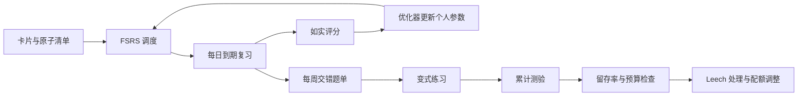

# 第 6 阶 · 间隔（Space） 巩固纪 · 在遗忘边缘科学复习

[上一阶 ←](./05-retrieve.md)

> 建议占时：长期（日均 15–30 min，经验值）｜ 证据总评：A·B（交错收益受材料相似度调节）｜ 上一阶：[检索](./05-retrieve.md) ｜ 下一阶：[精练](./07-drill.md)

## 阶段目标

- 调度系统化：启用 FSRS/同类调度器，跑通优化器并应用个人参数。
- 目标留存率：desired retention 从 0.9 起步，30 天留存统计贴近目标线。
- 每周有一份交错题单与变式练习记录，累计测验固定覆盖旧内容。
- 复习预算受控：日均 15–30 分钟以内，Leech 与到期积压有固定处理流程。

## 为什么放在这里（认知机制）

间隔位于巩固纪中段：检索解决「能不能取出来」，间隔解决「多久取一次、能留多久」。分布练习优于集中练习，证据来自 254 项实验、约 1.4 万名被试（[C04]）；最佳复习间隔约为目标保持期的 10–20%（[C06]）——保持期越长，间隔越要在更长时间尺度上展开。遗忘曲线本身被成功复现（[C14]），回落是默认走向，而间隔正是与之对抗的工程手段：FSRS 用 2.2 亿（220M）条学习日志训练，较当时最优方法提升 12.6%（[C26]）。交错与变式让「会在原地用」变成「到哪都能用」（[C07][C08][C30]）。间隔还是复习预算的守卫：把总量摊到长期，每日成本才能收进可承受区间。

## 核心方法（方法卡）

*等级为本项目对现有证据的综合判断，非期刊官方评级。*

### 间隔重复与最优间隔（Spaced Repetition & Optimal Gap）

- **机制**：在接近遗忘时复习——提取费力但可成功——痕迹被最强地刷新；间隔过密收益趋零，过疏则提取失败。最优间隔约为目标保持期的 10–20%（[C06]）；间隔与保持期的关系并非单一单调曲线（[C62]），细节宜交给算法。
- **怎么做**：
  - 按目标保持期设间隔：周测按天复习、年考按周起算。
  - 每个原子安排多次递增间隔（如 1 天、3 天、1 周、再拉长）。
  - 服从到期清单：到期就测，测完才看答案。
  - 长期目标用工具自动扩间隔，不手动拍脑袋。
- **最合适**：需要跨月保留的内容；**不适用**：一次性的临时信息——集中记一遍即可。
- **证据**：A + [C04][C06][C62]（https://pubmed.ncbi.nlm.nih.gov/16719566/；https://doi.org/10.1111/j.1467-9280.2008.02209.x；https://papers.nips.cc/paper_files/paper/2009/file/6bc24fc1ab650b25b4114e93a98f1eba-Paper.pdf）

### 现代调度算法（SM-2 → FSRS）

- **机制**：调度算法从 SM-2 演进到 FSRS：以 DSR 记忆模型（难度 Difficulty / 稳定性 Stability / 可提取性 Retrievability）为核心，对复习序列做随机最短路优化；FSRS 用 2.2 亿（220M）条学习日志训练，较当时最优方法提升 12.6%，并上线墨墨背单词（[C26]）。
- **怎么做**：
  - 用支持 FSRS 的调度器（Anki 及同类）替代旧 SM-2 参数。
  - 评分如实：想不起来才算忘记；答得慢就评「困难」，不要充作「记得」。
  - 导入历史复习记录跑优化器，生成个人参数，每 1–2 个月重跑一次。
  - 每月看一次「忘记率、卡片量、用时」三条曲线的方向。
- **最合适**：卡片量超过 200、持续 1 个月以上的复习系统；**不适用**：考前两周才开始——数据不足，先用默认参数跑。
- **证据**：A（工业级验证）+ [C26][C27]（https://dl.acm.org/doi/10.1145/3534678.3539081；https://github.com/open-spaced-repetition/fsrs4anki；https://github.com/open-spaced-repetition/free-spaced-repetition-scheduler）

### 交错练习（Interleaving）

- **机制**：混合题型与主题，迫使先判断「这题该用什么方法」，训练辨别与调度；材料相似度越高，收益越大——元分析覆盖 59 项研究、238 个效应量（[C08]）。数学练习 RCT 中，延迟测验交错组 61% vs 38%（d=0.83）；另一实验 72% vs 38%（d=1.05）（[C07]）。
- **怎么做**：
  - 把同章不同类型的题打乱成混合题单，少用「同一类连做 20 题」的块状练习。
  - 混入已学内容（与累计测验合流），让旧题定期复活。
  - 做错不退回同类连做，记录后继续混合。
  - 每周至少一次书面交错测验，限时或半限时。
- **最合适**：容易混用方法的内容（数学题型、语法点、程序模式）；**不适用**：第一轮全新知识先单点掌握再混合；内容互相独立时收益有限，调节因素见 [C08]。
- **证据**：A（受调节）+ [C07][C08]（https://gwern.net/doc/psychology/spaced-repetition/2019-rohrer.pdf；https://pubmed.ncbi.nlm.nih.gov/24578089/；https://psychologie.uni-wuerzburg.de/fileadmin/06020400/2019/Brunmair_Richter_in_press__2019_META-ANALYSIS_OF_INTERLEAVED_LEARNING.pdf）

### 变式练习（Variation Practice）

- **机制**：同一技能换情境、换参数、换外壳，迫使提取核心结构而非表面特征——保持与迁移都更好（情境干扰效应，[C30]）。
- **怎么做**：
  - 每个技能准备 3 种以上变式：换数字、换背景、换表述、换工具。
  - 只动无关特征、保留结构，检验自己提取的是方法还是套路。
  - 给卡片标注「变式轴」（在哪个维度变），便于系统生成。
  - 先自己写 1–2 个变式，再考虑让 AI 批量补。
- **最合适**：程序性技能、解题方法、语言结构；**不适用**：纯事实清单——变式价值低，改为轮换提取线索即可。
- **证据**：B + [C30]（https://gwern.net/doc/psychology/spaced-repetition/1979-shea.pdf）

### 累计测验（Cumulative Testing）

- **机制**：新内容与旧内容混考，持续给旧知识「到期提取」的机会，对抗遗忘；比只测近期内容更能暴露真实留存。
- **怎么做**：
  - 每周测验以近期内容为主，固定掺入更早单元，「永远带旧」。
  - 旧题从历史卡池随机抽取，不靠考前现编。
  - 记录各主题通过率变化，找出「总是掉」的主题回炉重编码。
  - 大考前把复测间隔刻意拉长，模拟真实延迟。
- **最合适**：需要跨月保留的一切内容；**不适用**：单次交付项目的中期，可用轻量抽查替代。
- **证据**：A + [C04][C07]（https://pubmed.ncbi.nlm.nih.gov/16719566/；https://gwern.net/doc/psychology/spaced-repetition/2019-rohrer.pdf）

### 复习预算管理（Review Budget）

- **机制**：复习成本随时间累积，不受控就会挤掉编码与精练；按「单位时间的保留增益」配比，宁可少而准。
- **怎么做**：
  - desired retention 从 0.9 起步；低于目标先查评分习惯，再考虑加量。
  - 设每日上限（15–30 分钟）：到点就停，先清到期旧债，后学新卡。
  - Leech（反复记不住的卡）三步：拆小、改写提问、加例子；仍无效就停用。
  - 每周看一次到期堆积曲线，超载就下调新卡配额。
- **最合适**：长期运转的调度系统；**不适用**：短期冲刺可临时上调，但要在截止日后安排还债期。
- **证据**：B + [C26]（https://dl.acm.org/doi/10.1145/3534678.3539081）

## 工具（开源优先）

| 工具 | 链接 | 用途 | 备注 |
|------|------|------|------|
| Anki + FSRS | https://github.com/ankitects/anki | 卡片复习与调度主体 | 开源；配 FSRS 调度使用 |
| FSRS4Anki | https://github.com/open-spaced-repetition/fsrs4anki | FSRS 的集成方案与说明 | 开源 |
| FSRS Helper | https://github.com/open-spaced-repetition/fsrs4anki-helper | 复习计划与优化辅助 | 开源 |
| Awesome FSRS | https://github.com/open-spaced-repetition/awesome-fsrs | 实现与资料索引 | 开源 |
| FSRS 算法库 | https://github.com/open-spaced-repetition/free-spaced-repetition-scheduler | 算法说明与参考实现（含 fsrs-rs / ts-fsrs / py-fsrs 等） | 开源 |
| org-fc | https://github.com/l3kn/org-fc | 在 org-mode 中做间隔复习 | 开源 |

## 过关自测

- FSRS 优化器跑通，并且用的是个人参数。
- 30 天留存统计在目标线附近（desired retention 0.9 起步）。
- 每周交错的测验有记录，最近四周都有。
- 每日复习用时在预算内，无长期到期积压。
- Leech 有处理记录：拆小、改写或停用，不无限循环。

## 常见误区

- 一天刷几百张（为算法打工）：复习量由目标保持期与留存目标决定，不是数量竞赛；超载时先砍新卡、保旧债（[C04][C06]）。
- 只学新卡、不清旧债：到期旧卡正处在最有价值的复习窗口附近，越拖成本越高；顺序是先旧后新。
- 手动改到期日：调度交给算法，手动干预只用于例外（[C27]）。
- 拿「连续打卡」当目标：留存率与交错测验成绩才是目标，打卡只是过程记录。

## AI 副驾（此阶段）

- 交错题单生成：把原子清单交给 AI，让它生成混合题单（含旧内容），你挑掉跑偏的题；先自己出一份对照。
- 排程不外包：调度交给 FSRS/工具（[C26][C27]），不要让 AI 凭感觉排复习计划；AI 只做「出题、变式、追问」。
- 先自己再 AI：答题在前、判卷在后；每两周安排一次「无 AI 日」独立复习（练习期依赖 AI 会削弱撤除后的表现（[C56]）；依赖风险另见 [C57]）。

## 参考

- [C04] Cepeda et al. (2006, Psychological Bulletin) — https://pubmed.ncbi.nlm.nih.gov/16719566/
- [C06] Cepeda et al. (2008, Psychological Science) — https://doi.org/10.1111/j.1467-9280.2008.02209.x
- [C07] Rohrer et al. (2020, JEP)；Rohrer, Dedrick & Stershic (2015) — https://gwern.net/doc/psychology/spaced-repetition/2019-rohrer.pdf；https://pubmed.ncbi.nlm.nih.gov/24578089/
- [C08] Brunmair & Richter (2019, Psychological Bulletin) — https://psychologie.uni-wuerzburg.de/fileadmin/06020400/2019/Brunmair_Richter_in_press__2019_META-ANALYSIS_OF_INTERLEAVED_LEARNING.pdf
- [C14] Murre & Dros (2015, PLOS ONE) — https://journals.plos.org/plosone/article?id=10.1371/journal.pone.0120644
- [C26] Ye, Su & Cao (2022, KDD) — https://dl.acm.org/doi/10.1145/3534678.3539081
- [C27] FSRS4Anki 与算法说明 — https://github.com/open-spaced-repetition/fsrs4anki；https://github.com/open-spaced-repetition/free-spaced-repetition-scheduler
- [C30] Shea & Morgan (1979) — https://gwern.net/doc/psychology/spaced-repetition/1979-shea.pdf
- [C56] Bastani et al. (2025, PNAS) — https://www.pnas.org/doi/10.1073/pnas.2422633122
- [C57] Fan et al. (2025, BJET) — https://bera-journals.onlinelibrary.wiley.com/doi/10.1111/bjet.13544
- [C62] Mozer et al. (2009, NeurIPS) — https://papers.nips.cc/paper_files/paper/2009/file/6bc24fc1ab650b25b4114e93a98f1eba-Paper.pdf

[下一阶 →](./07-drill.md)

