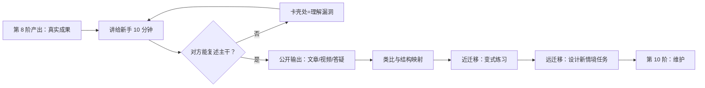

# 第 9 阶 · 教学（Teach） 传承纪 · 讲给别人听，迁移到新场景

> [上一阶 ←](./08-apply.md) ｜ 建议占时：5–15%（经验值）｜ 证据总评：B（中）｜ [下一阶 →](./10-maintain.md)

## 阶段目标
- 找一个真人（或 AI 扮演小白）讲 10 分钟，对方能复述主干与至少一个例子。
- 产出至少一件公开输出：文章、视频、答疑帖或讲稿图，有可访问链接。
- 完成至少一次跨情境迁移：在两个新场景里用同一知识成功解题。
- 为第 10 阶留下「讲解素材库」：每个主题配 5 句摘要、1 个例子、1 个反例、1 个类比。

## 为什么放在这里（认知机制）

教学的价值不在输出本身，而在它强制发生的认知动作：组织、简化、举例、找类比。费曼技巧的机制可拆为两块——自我解释（元分析显示中等偏上正效应 [C19]）与「预期要教」效应：被告知之后要教别人的学习者，学习组织度更高、回忆更好 [C25]。迁移是第二重考验：测试增强学习的迁移元分析显示近迁移支持强、远迁移有限 [C10]；迁移距离越远越难、必须刻意设计 [C12]——「学完自然会用」是错觉。生成式学习八策略（总结、绘制、想象、自测、自我解释、教学、作图、演练）给出一份可执行的动作清单 [C23]；类比与结构映射则说明，多个类比案例能帮助归纳出可搬运的共通图式 [C11]。本阶把「讲」与「迁移」放在一起：讲给新手暴露结构漏洞，跨情境练习检验结构是否真的可搬运。

## 核心方法（方法卡）

> 等级为本项目对现有证据的综合判断，非期刊官方评级。

### 费曼技巧（Feynman Technique）
- **机制**：把「讲给完全不懂的人」当检测器——卡壳处就是理解漏洞；机制上依赖自我解释 [C19] 与教学预期效应 [C25]。
- **怎么做**：
  1. 白纸写下主题，用最朴素的语言写一版解释，能不用术语就不用；必须用时换成大白话再写一遍；
  2. 标记卡壳、含糊或需要翻书的地方，它们是漏洞清单；
  3. 回材料补漏洞，换更简单的例子重写；
  4. 真的讲给一个人听（或对着录音讲），观察对方在哪皱眉、哪追问；
  5. 把最终版压缩成 5 句摘要 + 1 例 + 1 反例，存入素材库。
- **最合适**：概念性知识、任何「感觉会了」的内容。**不适用**：完全没入门的领域——先建图再讲。注意：费曼技巧属流行方法、无原始文献出处，机制对应 [C19][C25]。
- **证据**：B —— [C19](<https://eric.ed.gov/?id=EJ1186664>)（自我解释元分析）、[C25](<https://pubmed.ncbi.nlm.nih.gov/25084988/>)（预期要教）。

### 教学预期效应（Expecting to Teach）
- **机制**：知道「要教别人」会提高学习的组织度——自动去找结构、抓重点、想例子，编码更整齐。
- **怎么做**：
  1. 学习前先承诺：「这周末把 XX 讲给 YY 听」，写进日程；
  2. 记笔记时带着「怎么讲」的问题：记结构、例子、易错点，不抄原句；
  3. 每个知识点预写一句「对方问为什么，我怎么答」；
  4. 讲完请听众提 3 个问题，问题清单就是盲区清单；
  5. 把「预期要教」当常规学习姿势，而不是偶尔事件。
- **最合适**：需要长期保留的结构化知识。**不适用**：纯动作性技能的肌肉记忆训练——去第 7 阶。
- **证据**：B —— [C25](https://pubmed.ncbi.nlm.nih.gov/25084988/)。

### 生成式学习八策略（Eight Generative Strategies）
- **机制**：学习是从材料中「生成」意义的过程；写、画、演、教这类生成动作留下的痕迹深于被动接收。
- **怎么做**（轮换使用，每次选 2–3 个）：
  1. 总结（summarizing）：用自己的话写出主干与要点；
  2. 绘制（mapping）：画概念图、时间线或流程图；
  3. 想象（imagining）：把抽象内容转成具体画面；
  4. 自测（self-testing）：合上书自问自答（与第 5 阶衔接）；
  5. 自我解释（self-explaining）：边推理边说出理由；
  6. 教学（teaching）：讲给他人听；
  7. 作图（drawing）：把结构画出来；
  8. 演练（enacting）：用动作或角色扮演把过程演一遍。
- **最合适**：几乎所有学科的复习与输出环节。**不适用**：认知负荷已过载时——先减量，别叠加策略。
- **证据**：A —— [C23](https://eric.ed.gov/?id=EJ1120458)。

### 类比与结构映射（Analogy and Structure Mapping）
- **机制**：迁移的本质是识别源域与目标域的结构同构；多个类比案例能帮助归纳共通图式 [C11]。
- **怎么做**：
  1. 给每个新概念找你已精通的领域中一个类比；
  2. 不只给一个：收集 2–3 个不同来源的类比，再写出它们的共同结构；
  3. 标注类比边界：「哪里像、哪里不像」，防止过度外推；
  4. 让对方自己找新类比，你能判断对错说明你真懂；
  5. 好类比入素材库，注明适用与失效场景。
- **最合适**：抽象概念、陌生领域入门。**不适用**：只需记住的事实清单——直接用卡片。
- **证据**：B —— [C11](<https://www.semanticscholar.org/paper/7030688c1bd73740c5b588dc75a74c4db0bd4972>)（图式归纳与类比迁移）。

### 迁移设计（Transfer Design）
- **机制**：近迁移（换同类题）证据强，远迁移（跨领域）证据有限且需要刻意设计——迁移是被设计出来的，不是自然发生的。
- **怎么做**：
  1. 近迁移：同一技能做变式（换数字、情境、材料），与第 6 阶的变式练习衔接 [C30]；
  2. 远迁移：写「这个知识还能用在哪 3 个领域」，各配一个小任务；
  3. 做「结构对照表」：列出源情境与目标情境的相同点、差异点；
  4. 在新情境里先完整演练一次，哪怕笨拙，别等「准备好」；
  5. 记录迁移失败案例——失败比成功信息量更大。
- **最合适**：希望知识跨界可用时。**不适用**：考试型短期目标——先把近迁移做透。
- **证据**：B —— [C10](<https://pubmed.ncbi.nlm.nih.gov/29733621/>)（近迁移强、远迁移有限）、[C12](<https://doi.org/10.1037/0033-2909.128.4.612>)（迁移距离越远越难；Perkins & Salomon 文本引）。

### 适应性专长（Adaptive Expertise）
- **机制**：常规专长只让流程更快；适应性专长理解「为什么」，遇到新问题能重组旧技能，而不是照搬套路。
- **怎么做**：
  1. 每学会一个「怎么做」，追问「为什么这么做、什么时候会失效」；
  2. 主动改变条件（参数、限制、材料），看方法何时崩溃；
  3. 对比两种解法，写出各自适用边界；
  4. 讲「反例」与讲「正解」同等重要；
  5. 在新项目里故意留一处需要改流程的地方，练习应变。
- **最合适**：专家进阶、复杂领域。**不适用**：新手初期——先建立可靠的常规流程再求灵活。
- **证据**：C —— [C13](https://psycnet.apa.org/record/1986-97669-017)（适应性专长 vs 常规专长）。

## 工具（开源优先）

| 工具 | 链接 | 用途 | 备注 |
|------|------|------|------|
| Obsidian | https://github.com/obsidianmd/obsidian-releases | 讲稿与素材库（数字花园） | 本地 Markdown，便于发布 |
| Quartz | https://github.com/jackyzha0/quartz | 把笔记发布成公开站点 | 公开输出载体 |
| Zettlr | https://github.com/Zettlr/Zettlr | 长文写作与 Markdown 发布 | 适合写讲解文章 |
| Zotero | https://github.com/zotero/zotero | 引用与资料管理 | 讲解要有出处 |
| Better BibTeX | https://github.com/retorquere/zotero-better-bibtex | 稳定引用键 | 与 Zotero 配合 |
| Mermaid | https://github.com/mermaid-js/mermaid | 讲稿中的流程图/概念图 | 结构可视化 |

## 过关自测
- 讲 10 分钟后，真人（或 AI 扮演的小白）能复述主干与至少 1 个例子。
- 至少一件公开输出已发布，有可访问链接。
- 在两个新情境里用同一知识成功解题，并留下记录（迁移测试）。
- 素材库中每个主题都有：5 句摘要 + 1 例 + 1 反例 + 1 类比。
- 收到听众/读者反馈，并据此改过至少一版讲法。

## 常见误区
- 以为「学完自然会用」：迁移不自动发生，远迁移必须刻意设计 [C10][C12]。
- 教学=照本宣科：把材料念一遍不是教学；生成式动作（总结/作图/演练）才是 [C23]。
- 只教不收集反馈：没有听众的问题清单，就不知道自己的漏洞在哪 [C25]。
- 只讲给水平相当的人听：同伴互讲容易一起跳过不懂处；用「真小白」或「最笨的学生」做检验。

## AI 副驾（此阶段）
- 用法：AI 扮演「最笨的学生」专问蠢问题；再扮演「严苛评审」挑逻辑漏洞与遗漏；或生成初学者常见误解清单供你逐条讲解。
- 协议：先自己写讲稿与讲解，再交给 AI 挑错；不要直接拿 AI 的「标准讲解」照读；交付前做一次「无 AI 复现」——合上电脑给真人讲一遍。
- 风险证据：[C58](https://web.archive.org/web/20250601000000/https://www.media.mit.edu/publications/your-brain-on-chatgpt/) 为预印本、未同行评审：EEG 研究提示 LLM 辅助写作与更低的脑连通性、更弱的文本归属感相关（「认知债务」）。公开输出类任务尤其要保留自己的生成过程。

## 参考
- [C10] Pan & Rickard (2018)：测试增强学习的迁移元分析。https://pubmed.ncbi.nlm.nih.gov/29733621/
- [C11] Gick & Holyoak (1983)：图式归纳与类比迁移。https://www.semanticscholar.org/paper/7030688c1bd73740c5b588dc75a74c4db0bd4972
- [C12] Barnett & Ceci (2002)：远迁移分类学。https://doi.org/10.1037/0033-2909.128.4.612
- [C13] Hatano & Inagaki (1986)：适应性专长。https://psycnet.apa.org/record/1986-97669-017
- [C19] Bisra et al. (2018, EPR)：自我解释元分析。https://eric.ed.gov/?id=EJ1186664
- [C23] Fiorella & Mayer (2016, EPR)：生成式学习八策略。https://eric.ed.gov/?id=EJ1120458
- [C25] Nestojko et al. (2014)：预期要教 → 学习组织与回忆更好。https://pubmed.ncbi.nlm.nih.gov/25084988/
- [C30] Shea & Morgan (1979)：情境干扰效应。https://gwern.net/doc/psychology/spaced-repetition/1979-shea.pdf
- [C58] Kosmyna et al. (2025, MIT Media Lab 预印本)：LLM 辅助写作与「认知债务」。https://web.archive.org/web/20250601000000/https://www.media.mit.edu/publications/your-brain-on-chatgpt/

### 扩展阅读（v1.1 新增）
- [C85] Gentner (1983) 结构映射：类比的理论框架。 <https://ia801406.us.archive.org/18/items/gentner_dedre/gentner1983.pdf>
- [C101] The Learning Scientists：六大学习策略科普站。 <https://www.learningscientists.org/>

[上一阶 ←](./08-apply.md) ｜ [下一阶 →](./10-maintain.md)

---

**导航**：[📚 文档总目录](../../README.md) ｜ [🏠 项目主页](../../README.md) ｜ [在线主页](https://HuanMoovo.github.io/fuxi/)
