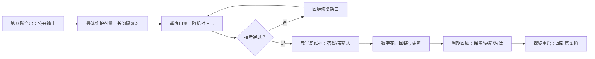

# 第 10 阶 · 维护（Maintain） 传承纪 · 低频保养，复利增值

> [上一阶 ←](./09-teach.md) ｜ 建议占时：长期低频（经验值）｜ 证据总评：B–C（中—条件）

## 阶段目标
- 建立最低维护剂量：长间隔复习 + 季度自测，让旧知识以可控速率保活。
- 把教学变成常规：每月至少一次社区答疑或带新人。
- 维护数字花园（digital garden）：旧笔记定期回链、更新、发布。
- 完成一次周期回顾（保留/更新/淘汰），并启动下一轮螺旋（回到第 1 阶）。

## 为什么放在这里（认知机制）

知识不用会退：技能随停练时间系统性衰减（技能衰减元综述，[C28] 文本引），遗忘曲线也已被成功复现 [C14]。但维护不需要「重新学一遍」——分布练习的元分析（254 项实验、约 1.4 万名被试）显示间隔复习效率极高 [C04]，最优间隔约为目标保持期的 10–20% [C06]，维护剂量远比直觉低。第二根杠杆是输出：知识要在实践社区中被使用才能保持活性 [C48]，而「预期要教」效应让答疑本身成为高质量复习 [C25]。制度化的维护靠自我调节循环——前瞻、执行、自省 [C37]，周期回顾把「感觉还行」换成可查清单。Zettelkasten 式的数字花园提供复利结构：越维护、链接越多、提取越容易 [C49]。完成一轮十阶，把同一套结构用在下一个领域，即螺旋重启。

## 核心方法（方法卡）

> 等级为本项目对现有证据的综合判断，非期刊官方评级。

### 最低维护剂量（Minimum Effective Maintenance Dose）
- **机制**：记忆强度随时间衰减，但长间隔复习能以极小成本把知识拉回；技能停练则系统性衰减（[C28] 文本引）。
- **怎么做**：
  1. 旧卡片调度交给 FSRS 自动排长间隔（月/季），不手动拍脑袋 [C26]；
  2. 每季度自测一次：随机抽 5–10 张旧卡 + 1 个综合小任务；
  3. 每月固定一个 15–30 分钟「保养时间块」，宁可少而准；
  4. 对想保留但不常用的技能，设「最低可见性」动作（每次一句话复盘）；
  5. 通过不了的旧卡回炉第 5/6 阶，不硬撑。
- **最合适**：所有长期想保留的知识与技能。**不适用**：明确不再需要的领域——允许主动淘汰（见方法四）。
- **证据**：B —— [C04](<https://pubmed.ncbi.nlm.nih.gov/16719566/>)、[C28]（文本引）；[C14](<https://journals.plos.org/plosone/article?id=10.1371/journal.pone.0120644>)（遗忘曲线复现）。

### 教学即维护（Teaching as Maintenance）
- **机制**：答疑与带新人把「回忆 + 组织 + 举例」打包成一次高强度输出，同时锁定社区身份——性价比最高的复习。
- **怎么做**：
  1. 每月至少一次在社区/群里回答一个具体问题，写清思路而不只给答案；
  2. 带一个新人：从听你讲，到独立完成一个小任务；
  3. 把高频问题整理成 FAQ 或文章，一次投入反复使用；
  4. 每季度把「被问倒的问题」列出来，回炉补课；
  5. 固定渠道与节奏（如每周三晚答疑），降低启动成本。
- **最合适**：有活跃社区或有新人的环境。**不适用**：领域缺少社区时——用公开写作替代。
- **证据**：B —— [C48](https://www.cambridge.org/highereducation/books/situated-learning/6915ABD21C8E4619F750A4D4ACA616CD)、[C25](https://source.wustl.edu/2014/07/expecting-to-teach-enhances-learning-recall)。

### 数字花园维护（Digital Garden Upkeep）
- **机制**：笔记是活系统：定期回链、更新、发布，旧内容才持续可检索、可迭代，否则会变成「数字废墟」。
- **怎么做**：
  1. 每月挑 3–5 篇旧笔记回访：补链接、改错、标注「已验证 / 已过时」；
  2. 新笔记发布前检查：能否挂到至少 1 篇旧笔记上；
  3. 重复主题合并成一篇主笔记，其余降为链接；
  4. 用 Quartz 一类工具公开发布，让「外人可访问」成为质量压力测试；
  5. 删除比更新更划算时，果断淘汰。
- **最合适**：长期积累的笔记系统。**不适用**：临时项目笔记——结项即可归档。
- **证据**：C —— [C49]（Zettelkasten 实践，文本引）。

### 周期回顾（Periodic Review）
- **机制**：自我调节学习靠「自省」环节纠偏 [C37]；固定节奏把模糊感觉变成「保留 / 更新 / 淘汰」的决策。
- **怎么做**：
  1. 周检视（15 分钟）：本周做了什么、卡在哪、下周一个重点；
  2. 季度回顾（60–90 分钟）：按清单过一遍所有活跃主题，逐条决策；
  3. 检查维护成本：哪些主题的投入产出已不划算；
  4. 更新下季度目标与时间块（回接第 1 阶的《学习契约》）；
  5. 回顾必须落地至少一条决定：改卡、删笔记或换目标。
- **最合适**：持续 3 个月以上的长期学习。**不适用**：单次短期任务——项目收尾复盘即可。
- **证据**：C —— [C37](https://www.leiderschapsdomeinen.nl/wp-content/uploads/2016/12/Zimmerman-B.-2002-Becoming-Self-Regulated-Learner.pdf)。

### 螺旋重启（Spiral Restart）
- **机制**：十阶结构本身可复用：地图、原子、练习、输出的骨架能迁移到新领域的入门，每轮成本更低 [C11]。
- **怎么做**：
  1. 选定下一个领域，重写一页《学习契约》（比上一轮更短）；
  2. 先找旧领域与新领域的结构同构点，复用骨架；
  3. 旧笔记当「对照材料」参考，而不是模板照抄；
  4. 带上上一轮的错误类型清单，同类错误少犯一轮；
  5. 明确「这轮不学什么」，避免无限扩张。
- **最合适**：完成过一个领域的学习循环之后。**不适用**：上一个领域还在深水区时——先收尾。
- **证据**：C —— [C11](https://www.sciencedirect.com/science/article/pii/0010028583900026)。

### 复利结构（Compounding Structure）
- **机制**：知识网络的链接随节点增加而增长，旧内容因被引用而持续增值——维护的是网络，不是单个文件 [C49]。
- **怎么做**：
  1. 每条新笔记至少链接 1 条旧笔记，并注明关系（支持/反对/延伸）；
  2. 定期「链接回访」：找出孤岛笔记，连回去或删掉；
  3. 把反复出现的概念提为「枢纽笔记」，集中维护；
  4. 公开枢纽笔记，用外部反馈升级网络；
  5. 每季度列出「被链接最多的 5 篇」，它就是你的核心资产清单。
- **最合适**：长期个人知识库。**不适用**：一次性资料收集。
- **证据**：C —— [C49]（Zettelkasten 实践，文本引）。

## 工具（开源优先）

| 工具 | 链接 | 用途 | 备注 |
|------|------|------|------|
| Anki | https://github.com/ankitects/anki | 长间隔复习（FSRS 调度） | 保养的主战场 |
| FSRS4Anki | https://github.com/open-spaced-repetition/fsrs4anki | 调度优化与参数拟合 | 让间隔自动变长 |
| Quartz | https://github.com/jackyzha0/quartz | 数字花园发布 | 公开即质量检验 |
| Obsidian | https://github.com/obsidianmd/obsidian-releases | 笔记网络维护与回链 | 复利结构的载体 |
| ActivityWatch | https://github.com/ActivityWatch/activitywatch | 时间去向统计 | 检查维护投入是否失衡 |
| Habitica | https://github.com/HabitRPG/habitica | 低频习惯与提醒 | 月/季级任务提醒 |

## 过关自测
- 3 个月后随机抽 5 张旧卡，全部能过，或明确知道缺口在哪。
- 近 30 天有新的输出记录（答疑、文章或作品更新）。
- 完成一次季度回顾，产出「保留 / 更新 / 淘汰」清单。
- 下一学习目标已启动：新契约已写，且第一周动作已执行。
- 随机抽 5 篇笔记，每篇都能挂到至少 1 条链接（网络没有大面积孤岛）。

## 常见误区
- 学过=永久拥有：技能随停练衰减有系统证据 [C28]；维护剂量可以低，但不能为零。
- 清空卡片=毕业：卸载调度系统等于放弃最低维护剂量，回炉成本更高 [C04]。
- 停止输出后知识悄然蒸发：只输入不输出，等于放弃 [C48] 的实践情境与 [C25] 的教学效应两根杠杆。
- 维护=每天打卡：把低频保养做成高频负担，反而更早被放弃；宁可少而准。

## AI 副驾（此阶段）
- 用法：让 AI 定期抽考旧主题（扮演考官，先考后判）；把 AI 当「要听你讲课的新人」维持教学输出；让 AI 找出旧笔记中过时或自相矛盾的表述。
- 协议：先自己回忆与作答，再让 AI 判分/点评；不把复习计划整体外包；撤掉 AI 后仍能独立复现讲解与解题。
- 风险证据：练习期依赖无护栏 AI，撤除后表现可能更差 [C56](<https://www.pnas.org/doi/10.1073/pnas.2422633122>)；并注意 AI 依赖与「元认知懒惰」风险 [C57](https://bera-journals.onlinelibrary.wiley.com/doi/10.1111/bjet.13544)。维护阶段的关键指标：离开 AI 还剩下什么。

## 参考
- [C04] Cepeda et al. (2006, Psychological Bulletin)：分布练习元分析（254 项实验、约 1.4 万名被试）。https://pubmed.ncbi.nlm.nih.gov/16719566/
- [C06] Cepeda et al. (2008, Psychological Science)：最优间隔约为目标保持期的 10–20%。https://doi.org/10.1111/j.1467-9280.2008.02209.x
- [C11] Gick & Holyoak (1983)：图式归纳与类比迁移。https://www.sciencedirect.com/science/article/pii/0010028583900026
- [C14] Murre & Dros (2015, PLOS ONE)：艾宾浩斯遗忘曲线复现。https://journals.plos.org/plosone/article?id=10.1371/journal.pone.0120644
- [C25] Nestojko et al. (2014)：预期要教 → 学习组织与回忆更好。https://source.wustl.edu/2014/07/expecting-to-teach-enhances-learning-recall
- [C26] Ye, Su & Cao (2022, KDD)：FSRS 调度器。https://dl.acm.org/doi/10.1145/3534678.3539081
- [C28] （文本引）Arthur et al. (1998)：技能衰减元综述。 <https://doi.org/10.1207/s15327043hup1101_3>
- [C37] Zimmerman (2002)：自我调节学习循环。https://www.leiderschapsdomeinen.nl/wp-content/uploads/2016/12/Zimmerman-B.-2002-Becoming-Self-Regulated-Learner.pdf
- [C48] Lave & Wenger (1991)：情境学习与合法边缘参与。https://www.cambridge.org/highereducation/books/situated-learning/6915ABD21C8E4619F750A4D4ACA616CD
- [C49] （文本引）Ahrens (2017)《How to Take Smart Notes》；Luhmann 卡片盒。 <https://www.soenkeahrens.de/en/takesmartnotes>
- [C56] Bastani et al. (2025, PNAS)：撤除无护栏 AI 后表现更差。https://www.pnas.org/doi/10.1073/pnas.2422633122
- [C57] Fan et al. (2025, BJET)：AI 依赖与「元认知懒惰」。https://bera-journals.onlinelibrary.wiley.com/doi/10.1111/bjet.13544

### 扩展阅读（v1.1 新增）
- [C101] The Learning Scientists：六大学习策略科普站。 <https://www.learningscientists.org/>
- [C97] 美国国家科学院 (2018) How People Learn II（免费全书）。 <https://nap.nationalacademies.org/catalog/24783/how-people-learn-ii-learners-contexts-and-cultures>

[上一阶 ←](./09-teach.md) ｜ [回到起点 ↗](./01-orient.md)（螺旋重启：把同一套十阶用在下一个领域）
