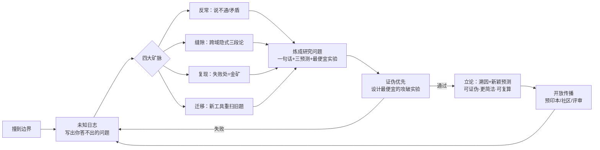

# 第 11 阶 · 拓界 Expand：从学到创造

> 十阶教你「把已知学会」；**拓界**教你「把未知变成已知」——这是十阶全部技能发挥最终用途的地方。
> 进入信号（满足任意一条）：① 你的问题在文献里找不到答案；② 学习材料已给不了新东西；③ 你已是身边/领域最强的人——**没有人能再教你**。

---

## 1. 三种边界：什么时候进入拓界

| 边界 | 症状 | 出路 |
|---|---|---|
| **知识边界** | 文献检索穷尽，仍无答案 | 你面对的是「未知」，不是「难」——研究问题库启动 |
| **认知边界** | 学习效率已到个人上限，加量边际收益趋零 | 突破来自**新问题**，不是新方法 |
| **社会边界** | 没有老师/同行能指出你的错 | 需要新的反馈源：社区、预印本、实验、复现 |

一句话：学习的尽头不是「学完了」，而是「没得学了」——**这正是研究的起点**。

## 8. 深潜：科学的科学（怎么让创造更可能发生）

- **团队优先**：1950–2000 年代论文分析显示，高影响论文中团队署名占比持续上升、单作份额下降——「组队」已从选项变成默认策略。[C185]
- **非常规组合出高影响**：把常规与新组合配比在特定「最优新奇度」区间的论文获得更高引用——太保守没人引，太怪异没人懂。[C186]
- **「巨星陨落」实验**：领域巨星离世后，新进入者带来更多高影响论文——权威在场会压制异议，元老退场是异端的机会窗口（Planck 原则的实验检验）。[C187]
- **统一视角**：科学学（science of science）用大规模数据研究科学生产与传播规律，是「如何做研究」的元方法。[C184]

## 拓界篇 · 五大赛道（扩展模块）

> 拓界不止于科研：**创造价值（创业）、经营关系（人际）、保养载体（长寿）、预判世界（未来）**同属「从已知到未知」的创造循环，各有独立方法论与证据体系。

| 赛道 | 一句话 | 入口 |
|---|---|---|
| **科研**（本文 §2–§7） | 把未知变成公共知识 | 本页 |
| **创业** | 把创造变成产品与组织（RCT 级证据） | [docs/expand/entrepreneurship.md](../expand/entrepreneurship.md) |
| **人际** | 把关系建模与经营（依恋 / 弱连接 / 互惠） | [docs/expand/relationships.md](../expand/relationships.md) |
| **长寿** | 把身体变成基础设施（证据分级表） | [docs/expand/longevity.md](../expand/longevity.md) |
| **未来** | 把世界地图更新到 2045（前沿科学雷达） | [docs/expand/futures.md](../expand/futures.md) |
| **整合** | 一个循环 · 五条赛道 · 五大理论支柱 | [docs/expand/integration.md](../expand/integration.md) |

## 2. 核心方法论（七步）

### 2.1 无知优先：从未知出发（等级 A）

- Firestein（哥伦比亚大学神经科学家）：科学不是「知识的集合」，而是「**可表述的无知**」的追索——把「我不知道」精炼成具体问题，就是研究的真工程。[C111]
- Hamming《You and Your Research》：每周至少三次自问——「**我领域里最重要的问题是什么？我目前在做吗？**」；只做重要问题，否则再聪明都浪费。[C112]
- 操作：维护「**未知日志**」——每读一篇文献/做完一个项目，记下它没回答的问题；每两周从日志里挑 1 条，写成半页「问题备忘」。

### 2.2 四个矿脉：去哪里挖可研究的问题（等级 A/B）

1. **反常矿（A）**：库恩《科学革命的结构》——范式危机源于**反常的累积**：说不通的现象、无法解释的数据、互相矛盾的结论。[C113] 行动：列出本领域 3 个「说不通」。
2. **缝隙矿（A）**：Swanson「**未识别的公共知识**」（1986）——A 文献说「A→B」，B 文献说「B→C」，却没有人说出「A→C」；他用此方法从两片不相干文献中推出「鱼油与雷诺氏病」的联系。[C115] 行动：选两个互不相干的领域，拿核心术语做交叉检索，找「隐式三段论」。
3. **复现矿（A）**：Open Science Collaboration（2015, *Science*）：100 项心理学复现研究仅 **36%** 得到显著结果——**每一个复现失败点，都是公开的问题富矿**。[C116]
4. **迁移矿（A）**：Wang et al.（2023, *Nature*）《Scientific discovery in the age of AI》——用新工具/新方法重扫旧问题，是 AI 时代最高产的挖矿方式。[C117]

### 2.3 把兴趣炼成可研究的问题（等级 A）

- 炼化公式：**一句话问题** ＋ **三个可检验预测** ＋ **最便宜的证伪实验**。
- 自检标准（研究问题四问）：可证伪吗？有争议性吗？（一个好问题至少让一半同行不确信）有意义吗？最便宜的攻破实验是什么？
- 经验标尺：**两个矛盾的观察 + 一个诱人的解释 = 可发表的起点**。

### 2.4 组队与规模：一个人还是团队？（等级 A）

- Wuchty et al.（2007, *Science*）：各学科**团队作者占比持续上升**，团队论文引用更高。[C118]
- Wu, Wang & Evans（2019, *Nature*）：**大团队「开发」，小团队「颠覆」**——想拓展已有方向加入大团队；想颠覆，找 2-5 人的小团队。[C119]

### 2.5 新理论如何立起来（等级 B）

- **溯因**（Peirce）：从意外观察 → 推定最可能的解释 → 大胆假设；而不是堆数据等结论。[C121]
- **Lakatos 研究纲领**：每个纲领有「硬核 + 保护带」；真正的进步判定 = 它是否给出**新颖的、非凡的预测**（预言新事实，而不是解释已知事实）。[C120]
- 检验四问：① 能否被证伪？② 预测了什么新东西？③ 比旧理论更简洁吗？④ 别人能复算吗？

### 2.6 AI 做研究搭档（等级 B）

- 工具链见 §4。玩法：AI 负责「候选假设 × 证据地图 × 反例搜索」，人类负责「问题品位 × 最终判断」。
- 护栏（沿用主框架 AI 协议 [C56][C57][C58]）：**先自己提交版本，再让 AI 挑错**；AI 给的每条结论都要回到原文核实；不允许 AI 代写「发现」。

### 2.7 发布与传播：让世界帮你检验（等级 A）

- **预注册 + 开放数据/代码**（FAIR 原则）[C122]：减少自欺，让工作可复现。
- **尽早公开**：预印本（arXiv）与社区（OpenReview）的「攻击」是最快的检验——闭门打磨 3 个月，不如公开挨批 3 天。

## 3. 拓界循环（流程图）

## 4. 工具链（全部经核验、可点击）

| 任务 | 工具 | 链接 |
|---|---|---|
| 文献问答与引用核查 | PaperQA2 | <https://github.com/Future-House/paper-qa> |
| 多步深度调研 | open_deep_research | <https://github.com/langchain-ai/open_deep_research> |
| 把研究流程编程化 | DSPy | <https://github.com/stanfordnlp/dspy> |
| 文献管理 | Zotero | <https://github.com/zotero/zotero> |
| 引用与元数据 | Better BibTeX / scholarly | <https://github.com/retorquere/zotero-better-bibtex> · <https://github.com/scholarly-python-package/scholarly> |
| 论文追踪 | arxiv-sanity-lite | <https://github.com/karpathy/arxiv-sanity-lite> |

## 5. 过关检验（本阶交付物）

- [ ] 「未知日志」≥ 20 条，且至少 1 条被炼成「一句话问题 + 三个可检验预测」；
- [ ] 完成一次「隐式三段论」检索（跨两个不相交领域）；
- [ ] 找到并记录 1 个反常/复现失败现象；
- [ ] 写出一个「证伪优先」的实验设计；
- [ ] 给出一个**新颖预测**（不是解释已知数据）；
- [ ] 公开传播至少一次，并吸收 ≥ 3 条批评。

建议起步动作：30 天拓界循环 —— 第 1 周建未知日志；第 2 周跑四个矿脉；第 3 周炼问题 + 证伪设计；第 4 周公开并收集批评。

## 6. 与主框架的关系

- 十阶解决「从 0 到已知」；拓界解决「从已知到未知」。它不是第十一课，而是十阶所有技能的**最终用途**：
  - ② 建图 → 文献地图；③ 拆解 → 问题分解；⑤ 检索 → 复现他人结果；⑥ 间隔 → 长周期研究节奏；⑨ 教学 → 发表与传播。
- 适用范围不限于学术：开源项目、写作、产品、艺术同理——「**没人做过**」就是最稀缺的原料。

## 参考（拓界篇）

- [C111] Firestein, S. — *The Pursuit of Ignorance*（TED 演讲）：<https://www.ted.com/talks/stuart_firestein_the_pursuit_of_ignorance>
- [C112] Hamming, R. — *You and Your Research*（全文页）：<https://www.cs.virginia.edu/~robins/YouAndYourResearch.html>
- [C113] Kuhn, T. — *The Structure of Scientific Revolutions*（SEP 词条）：<https://plato.stanford.edu/entries/thomas-kuhn/>
- [C114] Popper, K. — 可证伪性与批判理性主义（SEP 词条）：<https://plato.stanford.edu/entries/popper/>
- [C115] Swanson, D. R. (1986). Undiscovered Public Knowledge. *The Library Quarterly*：<https://www.journals.uchicago.edu/doi/10.1086/601720>
- [C116] Open Science Collaboration (2015). Estimating the reproducibility of psychological science. *Science*：<https://pubmed.ncbi.nlm.nih.gov/26315443/>
- [C117] Wang, H. et al. (2023). Scientific discovery in the age of artificial intelligence. *Nature*：<https://www.nature.com/articles/s41586-023-06221-2>
- [C118] Wuchty, S. et al. (2007). The increasing dominance of teams in production of knowledge. *Science*：<https://pubmed.ncbi.nlm.nih.gov/17656717/>
- [C119] Wu, L., Wang, D. & Evans, J. (2019). Large teams develop and small teams disrupt science and technology. *Nature*：<https://www.nature.com/articles/s41586-019-0941-9>
- [C120] Lakatos, I. — 科学研究纲领方法论（SEP 词条）：<https://plato.stanford.edu/entries/lakatos/>
- [C121] 溯因推理（Abduction, Peirce）（SEP 词条）：<https://plato.stanford.edu/entries/abduction/>
- [C122] FAIR 数据原则：<https://www.go-fair.org/fair-principles/>

> 部分出版社链接对机器人返回 403，浏览器可正常打开（本项目已将此情况列入链接检查的接受范围）。

---

[← 返回十阶：⑩ 维护](./10-maintain.md) ｜ [项目主页](../../README.md)
- [C184] Fortunato et al. (2018). Science of Science（综述）: <https://arxiv.org/abs/1804.03461>
- [C185] Wuchty, Jones & Uzzi (2007). The Increasing Dominance of Teams in Production of Knowledge: <https://pubmed.ncbi.nlm.nih.gov/17431139/>
- [C186] Uzzi et al. (2013). Atypical Combinations and Scientific Impact: <https://www.science.org/doi/10.1126/science.1240474>
- [C187] Azoulay, Fons-Rosen & Graff Zivin (2019). Does Science Advance One Funeral at a Time?（AER）: <https://www.aeaweb.org/articles?id=10.1257/aer.20161574>
