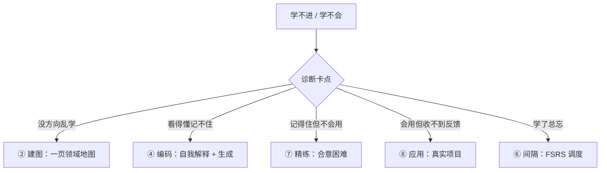

# 深度剖析① 方法碎片化：收藏了 100 个技巧，为什么反而不会学了

> 症状自查 → 机制解剖 → 系统化对照 → 本框架的解法。本文是「[为什么需要伏羲框架](../why.md)」四论点的深度展开之一。
> 系列：**① 方法碎片化（本文）** · [② 伪科学横行](pseudoscience.md) · [③ 爽感陷阱](fluency-trap.md) · [④ AI 时代的新风险](ai-risks.md)

## 0. 症状自查（中 3 条以上，这一页就是写给你的）

- [ ] 收藏夹里躺着几十上百个「学习方法」，但从未系统用过其中任何一个；
- [ ] 每个新技巧都热情试用两三天，然后无声放弃；
- [ ] 说不清「现在这个阶段该用哪个方法、为什么」；
- [ ] 换工具的频率高于水平提升的频率；
- [ ] 学不进去时，第一反应是「再找一个更好的方法」，而不是诊断卡点。

## 1. 这不是你的错：碎片化的三个结构性原因

### 1.1 技巧本身「带条件」，传播中全被剥掉了

每个学习技巧都有适用前提：

- **检索练习**（A 级）：前提是先有可提取的知识结构——对着空白脑子搞测验没有意义 [C01]；
- **间隔重复**（A 级）：最佳间隔取决于「要保留多久」——不是固定「每天复习」 [C04]；
- **刻意练习**（B 级，领域依赖）：元分析显示它可解释的绩效方差在游戏约 **26%**、音乐约 **21%**、体育约 **18%**，而在教育约 **4%**、专业职业**不足 1%** [C32]——「一万小时」式的万能承诺是对原始结论的系统性夸大。

→ 当技巧被压成 30 秒的短视频，**条件、剂量、顺序**全部丢失，只剩口号。

### 1.2 方法有「效用等级」，碎片化让人无从分辨

对十种常见学习技巧的系统评估把它们分成了三档 [C05]：

| 效用档位 | 代表方法 | 结论 |
|---|---|---|
| **高效用** | 练习测验（检索练习）、分散练习（间隔） | 跨年龄、跨材料、跨标准**稳定有效** |
| **中等效用** | 精细提问、自我解释、交错练习 | 有效，但更依赖实施方式 |
| **低效用** | 划线、重读、摘要、关键词记忆术 | 「感觉在学」，收益微弱 |

碎片化传播让三个档位在信息流里被「民主化」——低效用方法因为**容易演示、感觉良好**，传播反而最广。

### 1.3 换方法本身就有认知成本

任务切换的经典实验表明：即使任务简单，频繁交替也会持续消耗执行控制资源、产生可靠的切换代价 [C211]。
→ 「方法流浪」不是免费的：每换一次都要从零重建习惯回路，而重建期恰好是所有新方法看起来「没用」的阶段。

## 2. 系统化 vs 碎片化（一张表看清）

| 维度 | 碎片化视角 | 系统化视角 |
|---|---|---|
| 问题定义 | 「学不会」 | 「卡在编码 / 检索 / 精练 / 应用哪一环」 |
| 方法选择 | 按流行度、新鲜感 | 按证据等级 × 卡点匹配 |
| 顺序 | 随机 | 有阶段依赖（先建图再编码） |
| 剂量 | 没有概念 | 间隔、频次、单次时长可调参 |
| 验证 | 凭感觉 | 延迟测验 / 作品产出 |
| 出错时 | 再换一个方法 | 先诊断，再微调 |

## 3. 缺的其实是「元层地图」

学习科学早已给出框架层答案：学习是「计划 → 执行 → 监控 → 反思」的自我调节循环 [C210]；认知负荷理论指出不同阶段的瓶颈不同——新手瓶颈是工作记忆容量，熟手瓶颈是图式自动化 [C15]。

**碎片化方法的根本缺陷**：它们几乎都发生在「执行」层；而大多数人其实卡在「选择」与「验证」层。

## 4. 本框架的解法

1. **十阶时间线**：回答「何时用哪个」——[十阶总览](../stages/)；
2. **证据分级 A/B/C/D**：回答「哪个值得用」——[证据页](../evidence.md)；
3. **心法引擎（三恒两尺一原则）**：回答「怎么组合」——[引擎区](../../README.md#引擎三恒--两尺--一原则)；
4. **工具链**：回答「用什么执行」——[工具页](../tools.md)。

## 5. 与其他三篇的连接

- 碎片里混着大量伪科学 → [② 伪科学横行](pseudoscience.md)
- 碎片技巧常常只提供「爽感」→ [③ 爽感陷阱](fluency-trap.md)
- AI 让技巧产量爆炸、筛选更难 → [④ AI 时代的新风险](ai-risks.md)

## 检验清单（能做到才算过关）

- [ ] 能说出自己当前阶段的 **1 个主方法 + 2 个辅助方法**及选择理由；
- [ ] 间隔复习有可执行的工具化安排（不是「记得就复习」）；
- [ ] 连续 4 周没有更换主方法，直到完成一次验证；
- [ ] 能在 60 秒内解释「为什么检索练习优于重读」。

## 参考（本文）

- [C01] Karpicke & Roediger (2008). The Critical Importance of Retrieval for Learning（Science）
- [C04] Cepeda et al. (2006). Distributed practice in verbal recall tasks（Psych Bulletin）
- [C05] Dunlosky et al. (2013). Improving Students' Learning With Effective Learning Techniques（PSPI）
- [C15] Sweller, van Merriënboer & Paas (2019). Cognitive Architecture and Instructional Design: 20 Years Later
- [C32] Macnamara et al. (2014). Deliberate Practice and Performance: A Meta-Analysis
- [C210] Zimmerman (2002). Becoming a Self-Regulated Learner: <https://doi.org/10.1207/s15430421tip4102_2>
- [C211] Rubinstein, Meyer & Evans (2001). Executive Control of Cognitive Processes in Task Switching: <https://psycnet.apa.org/doiLanding?doi=10.1037%2F0096-3445.130.4.763>
