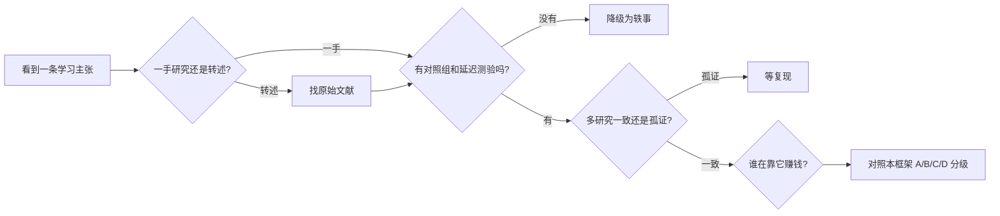

# 深度剖析② 伪科学横行：为什么最流行的学习方法大多是错的

> 六大神话裁决书 → 伪科学的传播机制 → 60 秒鉴别 SOP。本文是「[为什么需要伏羲框架](../why.md)」四论点的深度展开之二。
> 系列：[① 方法碎片化](fragmentation.md) · **② 伪科学横行（本文）** · [③ 爽感陷阱](fluency-trap.md) · [④ AI 时代的新风险](ai-risks.md)

## 0. 症状自查

以下说法，你听过或转发过任何一条吗？

- [ ] 「学习金字塔：听讲只记住 5%，教别人能记住 90%」；
- [ ] 「找到你的学习风格（视觉型 / 听觉型），匹配着学最高效」；
- [ ] 「掌握速读，每分钟 3000 词」；
- [ ] 「开发右脑 / 人只用了 10% 大脑」；
- [ ] 「语言关键期一过就学不会了」；
- [ ] 「听着音乐/睡着觉也能学习」。

## 1. 六大神话的裁决书

| 主张 | 为什么诱人 | 证据裁决 | 文献 |
|---|---|---|---|
| 学习金字塔（保持率锥） | 数字具体、有「科学感」 | 全部数字**找不到原始出处**，系以讹传讹 | [C05][C52] |
| 学习风格匹配教学 | 「尊重个体差异」听起来天然正确 | 严格检验（按风格匹配教学后的对照实验）**没有支持**；跨研究均未发现匹配增益 | [C214] |
| 速读（3000 词/分钟） | 解决「读不完」的焦虑 | 受眼动与工作记忆瓶颈约束，超过正常速度必然**牺牲理解** | [C215] |
| 神经神话（右脑 / 10% 大脑 / 关键期绝对化） | 有「脑科学」光环 | 教师群体中广泛流传，但均无神经科学支持 | [C216] |
| 「脑词加持」的解释更可信 | 加了「前额叶激活」等术语显得高级 | 实验证明：**无关的神经科学信息让坏解释被评为更可信** | [C217] |
| 神奇记忆术（过目不忘） | 承诺脱离努力的捷径 | 与工作记忆容量、加工深度的基本证据相悖 | [C15] |

> 关于学习金字塔：本框架的 [误区页](../myths.md) 收录了完整清单与逐条考证。

## 2. 伪科学为什么总能赢（四个机制）

1. **确认偏误**：我们倾向于记住支持已有信念的信息、忽略反面证据——这是人类认知的默认设置，不是智商问题 [C218]；
2. **激励错位**：卖课者需要「神奇承诺」，而「检索练习 + 间隔重复」这种诚实答案不好卖；
3. **传播链条**：教师 → 培训体系 → 教材 → 短视频，错误信息每经一手都获得「权威加持」 [C216]；
4. **神经美化**：给解释加上脑科学术语，可信度立刻上升——传播者未必有意欺骗 [C217]。

## 3. 60 秒鉴别 SOP（遇到任何学习主张先跑一遍）

- [ ] 来源：原始论文可查吗？（还是一句「哈佛研究证明」）
- [ ] 对照：有无对照组、延迟测验、效应量？
- [ ] 复现：是 meta 分析还是单次实验？
- [ ] 激励：推荐者卖不卖课、带不带货？
- [ ] 分级：放到 A/B/C/D 哪一档？「不确定」就标注「不确定」。

## 4. 本框架的对策

- [误区页](../myths.md)：高频神话逐条建档、附裁决文献；
- [证据页](../evidence.md)：所有方法带 A/B/C/D 等级与来源，**等级为本项目综合判断、非期刊官方评级**；
- 链接全量体检 + CHANGELOG 公开纠错——错误被公开修正，本身就是方法的演示。

## 检验清单

- [ ] 能当场指出「学习金字塔」哪一步是伪的（数字无出处）；
- [ ] 能解释为什么「学习风格匹配」在教育实验中通不过检验；
- [ ] 认识至少一个「神经美化」案例，并能识别话术结构；
- [ ] 遇到新主张时，能自觉跑一遍 60 秒 SOP。

## 参考（本文）

- [C05] Dunlosky et al. (2013)（同前）
- [C15] Sweller et al. (2019)（同前）
- [C52] Letrud (2012) 与 Subramony et al. (2014)：学习金字塔考证（详见 [证据页](../evidence.md)）
- [C214] Pashler et al. (2008). Learning Styles: Concepts and Evidence: <https://journals.sagepub.com/doi/10.1111/j.1539-6053.2009.01038.x>
- [C215] Rayner et al. (2016). So Much to Read, So Little Time（速读科学）: <https://journals.sagepub.com/doi/10.1177/1529100615623267>
- [C216] Dekker et al. (2012). Neuromyths in Education: <https://www.frontiersin.org/articles/10.3389/fpsyg.2012.00429/full>
- [C217] Weisberg et al. (2008). The Seductive Allure of Neuroscience Explanations: <https://pubmed.ncbi.nlm.nih.gov/18275336/>
- [C218] Nickerson (1998). Confirmation Bias: A Ubiquitous Phenomenon: <https://doi.org/10.1037/1089-2680.2.2.175>

---

**导航**：[📚 文档总目录](../../README.md) ｜ [🏠 项目主页](../../README.md) ｜ [在线主页](https://HuanMoovo.github.io/fuxi/)
